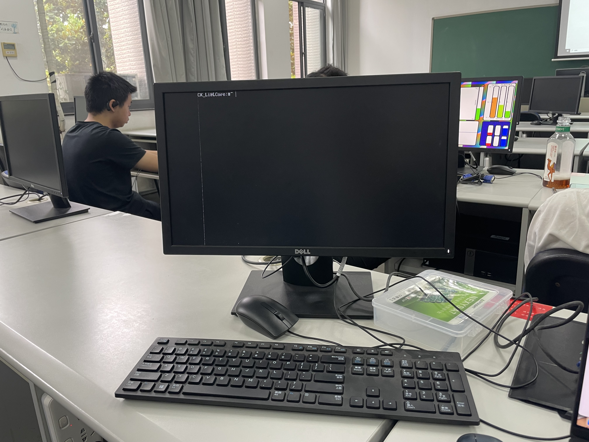

# 数字逻辑与计算机组成实验 第十次实验 计算机系统设计实验 实验报告

> 211502008 李诚希
>
> chengxili@smail.nju.edu.cn

该实验的目的是将之前设计的CPU与显示器终端和键盘数据组合并设置合理的内存映射，然后用c编写程序实现如下功能：
根据输入命令执行对应的子程序，并将执行结果显示到显示器上；

- 如果输入命令不对，则显示：UnknownCommand。
- 输入hi xxx，显示Helloxxx!
- 输入time，显示系统运行时间。
- 输入fib n，显示斐波那契数列（1-n）。
- 输入sort，通过键盘输入未排序数据，然后显示排好序的数据（支持正负数）。
- 输入cal，计算通过键盘输入的表达式。
- 输入exit，返回初始页面。
- 输入clear，清空控制台。

## 整体设计

该实验的硬件部分在之前CPU的设计基础上使用内存映射IO的方式给CPU连接键盘和终端。

我设计的内存布局为，0x00000000到0x000FFFFF为代码区，0x00100000开始的128k为除了栈区外的其他区域，栈区为从0xFFFFFFFF开始向下生长的128k。这三个存储器在top模块中使用多路选择器与CPU连接并把正确的控制信号传递给正确的存储器。

终端窗口的buffer在地址空间中为从0xa0000000开始的2400个字节，存放控制台光标地址为0xa0000FFF，CPU可以向其中写入和读取数据，而控制台模块会从中读取相应位置的字符和是否为光标并通过VGA模块绘制在屏幕上。

键盘IO的内存映射地址空间为0xa0001000 到 0xa0001AFF，其中从0xa0001000 到 0xa00010FF为键盘扫描码映射区域，每个按键对应一个字节，某个位置读结果为1(0xFF)则表明该地址键盘扫描码对应按键为按下状态，反之认为该按键为抬起状态，cpu只能从该区域读取而不能写入，键盘控制器负责向键盘IO区域写入当前键盘状态。CPU通过软件扫描整个区域以获知键盘按下情况，与历史记录比较并读取发生改变的键盘位置的字符。

与之前的CPU设计相同，0x1004F000 为数码管，CPU可以向该地址写入一个32位无符号数，该数字会被以16进制形式显示在数码管上。

0xa0001B00 为从系统开始运行到当前的毫秒数，对于cpu只读，top模块中每过1ms会将其加一。（此时认为系统运行在100MHz）

## 模块设计

与CPU有关的模块与前两次实验完全相同，就不再过多赘述。

### 键盘

键盘的接收器与实验六完全相同，在此只给出控制器的设计，完整代码详见附件中的工程目录。

键盘控制器用于处理来自PS/2键盘的信号。它的主要功能包括：

* **时钟分频** ：将100MHz的系统时钟分频到50MHz，用于键盘接收器模块。
* **键盘接收** ：`KeyBoardReceiver`子模块负责接收键盘扫描码，当有数据准备好时，`ready`信号会被置位。
* **内存映射输出** ：通过 `memmap_addr`地址访问 `kbcode_on`数组，如果对应的键被按下，则 `memmap_output`输出 `0xffffffff`，否则输出 `0`。
* **键盘状态跟踪** ：使用 `snapshot`寄存器来跟踪键盘扫描码的变化。如果检测到键盘码的变化，会更新 `kbcode_on`数组来记录哪个键被按下或释放。

模块的工作流程是：

1. 系统时钟 `CLK100MHZ`通过分频产生 `CLK50MHZ`。
2. `KeyBoardReceiver`子模块使用 `CLK50MHZ`来同步PS/2键盘的 `PS2_CLK`和 `PS2_DATA`信号。
3. 当键盘有按键动作时，`keycode`会被更新，并通过 `memmap_addr`提供给外部访问。
4. 如果 `keycode`的高8位是 `0xf0`，表示一个键被释放；否则，表示一个键被按下。
5. `memmap_output`根据 `kbcode_on`数组的状态提供内存映射的输出，用于指示特定键是否被按下。

```verilog
module KeyboardCtrl(
    input CLK100MHZ,   //ϵͳʱ���ź�
    input PS2_CLK,    //���Լ��̵�ʱ���ź�
    input PS2_DATA,  //���Լ��̵Ĵ�������λ
    input BTNC,      //Reset
    input [31:0] memmap_addr,
    output [31:0] memmap_output
);
    wire [31:0] keycode;
    wire ready;
    reg CLK50MHZ=0;  
    always @(posedge(CLK100MHZ))begin
        CLK50MHZ<=~CLK50MHZ;
    end
    KeyBoardReceiver keyboard_0(
        .keycodeout(keycode),           //���յ�����4������ɨ����
        .ready(ready),                     //���ݾ�����־λ
        .clk(CLK50MHZ),                        //ϵͳʱ�� 
        .kb_clk(PS2_CLK),                    //���� ʱ���ź�
        .kb_data(PS2_DATA)                    //���� ��������
    );
    reg [31:0] snapshot;
    reg kbcode_on [2**8 - 1 : 0];
    assign memmap_output = (kbcode_on[memmap_addr[7:0]] == 1) ? 32'hffffffff : 32'h0;
    always @(posedge CLK100MHZ) begin//我们相信ps2时钟足够慢
        if(snapshot != keycode) begin
            snapshot <= keycode;
            if(keycode[15:8] == 8'hf0) begin
                kbcode_on[keycode[7:0]] <= 1'b0;
                // $display("0x%h lift", keycode[7:0]);
            end else if(keycode[7:0] != 8'hf0) begin
                kbcode_on[keycode[7:0]] <= 1'b1;
                // $display("0x%h on", keycode[7:0]);
            end
        end
    end
endmodule
```

### 控制台

控制台读取buffer中的字符并使用LAB6中的字符显示模块和VGA显示模块在显示器上显示这些字符。（显示模块和字符显示模块详见工程目录）

控制台的三个模块组成一个显示控制系统，用于在屏幕上显示字符和管理内存。下面是每个模块的简短介绍：

 **consoles_display 模块** ：

* 该模块负责计算字符在屏幕上的地址(`char_addr`)。
* 它使用输入地址(`addra`)来确定字符的位置，并将其转换为屏幕坐标。
* `get_charpix`子模块用于确定字符的像素是否应该被点亮(`is_light`)，从而决定字符的颜色(`color`)。

 **consoles_ctrl 模块** ：

* 这个模块处理数据的读写操作。
* 它根据内存操作类型(`MemOp`)来格式化输出数据(`dataout`)。
* `consoles_mem`子模块用于实际的内存读写操作。

 **consoles_mem 模块** ：

* 这是一个内存模块，用于存储和检索字符数据，为控制台的buffer。
* 该模块在读时钟(`Rclk_A`, `Rclk_B`)的下降沿和写时钟(`Wclk`)的上升沿进行数据的读取和写入。

这些模块通常用于基于FPGA的视频显示系统，其中 `consoles_display`负责生成视频信号，`consoles_ctrl`管理内存访问，而 `consoles_mem`提供必要的存储功能

```verilog
module consoles_display(
    input [31:0] addra,
    input clk,
    output [17:0] char_addr,
    output memread_clk,
    input [7:0] text_read,
    output [11:0] color,
    input [31:0] ptr
);
    assign memread_clk = clk;
    wire [31:0] addr_W;
    assign addr_W = (addra) % (640 * 480);//addra > 0 ? (addra - 1) % (640 * 480) : (640 * 480) - 1;
    wire [31:0] addr_temp = 80 * (addr_W / (640 * 16)) + (((addr_W % (640 * 16)) / 8) % 80);
    assign char_addr = addr_temp[17:0];
    wire [31:0] xw = addr_W % 8, yw = ((addr_W / 640) % 16);
    wire is_light;
    get_charpix pix(
        .c(text_read),
        .x(xw[5:0]),
        .y(yw[5:0]),
        .in_ptr(ptr[17:0] == char_addr),
        .is_light(is_light)
    );
    assign color = is_light ? 12'b111111111111 : 12'b000000000000;
endmodule

module consoles_ctrl(
    output [31:0] dataout, 
    output [7:0] textdataout,
    input Rclk_A,  
    input Rclk_B,  
    input Wclk,  
    input [2:0] MemOp,  
    input [31:0] datain,  
    input [17:0] addr_A,  
    input [17:0] addr_B,  
    input we
);
    wire [7:0] cpudataout;
    wire [31:0] outW_T;
    assign outW_T = {24'b0, cpudataout};
    assign dataout = 
                    MemOp == 3'b000 ? ({outW_T[7] == 1 ? 24'b111111111111111111111111 : 24'd0, outW_T[7:0]}) :
                    MemOp == 3'b001 ? ({outW_T[15] == 1 ? 16'b1111111111111111 : 16'd0, outW_T[15:0]}) :
                    MemOp == 3'b010 ? (outW_T[31:0]) :
                    MemOp == 3'b100 ? ({24'd0, outW_T[7:0]}) :
                    MemOp == 3'b101 ? ({16'd0, outW_T[15:0]}) :
                    0;
    consoles_mem consoles_0(
        .addr_A({14'b0, addr_A}),
        .addr_B({14'b0, addr_B}),
        .data_in(datain[7:0]),
        .we(we),
        .Rclk_A(Rclk_A),
        .Rclk_B(Rclk_B),
        .Wclk(Wclk),
        .data_out_A(cpudataout),
        .data_out_B(textdataout)
    );
  
endmodule

module consoles_mem(
    input wire [31:0] addr_A,
    input wire [31:0] addr_B,
    input wire [7:0] data_in,
    input wire we,
    input wire Rclk_A,
    input wire Rclk_B,
    input wire Wclk,
    output reg [7:0] data_out_A,
    output [7:0] data_out_B
);
    (* ram_style="block" *) reg [7:0] data [2399:0];
    always @(negedge Rclk_A)begin
        data_out_A <= data[(addr_A <= 2399) ? addr_A : 0];
    end
    assign data_out_B = data[(addr_B <= 2399) ? addr_B : 0];
    always @(posedge Wclk) begin
        if(we && addr_A <= 2399) begin
            data[addr_A] <= data_in;
        end
    end 
  
endmodule
```

### top模块

top模块将上述内容连接并进行内存映射。

具体来说，其结构如下：

1. **模块接口**：`SingleCycleCPU_top` 是顶层模块的名称，它定义了一系列输入输出端口，包括时钟信号CLK、复位按钮BTNC、数据输出dataout_L16b、PS2接口信号等。
2. **时钟分频**：通过 `clk_counter`计数器和 `cpuclk_reg`寄存器实现时钟分频，将输入时钟CLK分频为 `cpuclk`，用于CPU的时钟。
3. **CPU实例化**：`SingleCycleCPU CPU0` 实例化了一个单周期CPU，连接了时钟、复位信号、指令和数据存储器的接口。
4. **存储器模拟**：模块中包含了指令存储器 `ram_64k InstrMem`和数据存储器的模拟，以及对应的读写时钟控制。
5. **VGA显示**：`VGASim display` 模块用于生成VGA信号，可能用于显示CPU的运行状态或图形界面。
6. **键盘控制**：`KeyboardCtrl kb_0` 模块用于处理PS2键盘的输入。
7. **控制台显示**：`consoles_ctrl` 和 `consoles_display` 模块用于处理控制台的显示，包括字符的读取和写入。
8. **堆和栈内存**：代码中定义了堆和栈的内存区域，并提供了读写控制。
9. **数码管显示**：通过 `seg`模块控制数码管的显示，这里使用了条件编译来适应不同的硬件平台。
10. **时间计数**：`time_reg` 和 `cycle_counter` 用于记录系统运行的时间。
11. **地址映射**：代码中定义了不同的内存区域和特殊功能的地址映射，例如键盘IO区域、控制台窗口、数码管地址等。

> 注：该代码为verilator+NVboard设计，在烧录入FPGA前需要将VGA的输入时钟更换为分频器IP核生成的符合VGA标准的频率

```verilog
`timescale 1ns / 1ps
`define NVB

module SingleCycleCPU_top(
    input CLK,
    input BTNC,
    output [15:0] dataout_L16b,
    input PS2_CLK,    //���Լ��̵�ʱ���ź�
    input PS2_DATA,  //���Լ��̵Ĵ�������λ
`ifdef NVB
    output [7:0] o_seg0,
    output [7:0] o_seg1,
    output [7:0] o_seg2,
    output [7:0] o_seg3,
    output [7:0] o_seg4,
    output [7:0] o_seg5,
    output [7:0] o_seg6,
    output [7:0] o_seg7,
    // for nvboard
    output VALID,
`else
    output [6:0]SEG,   
    output [7:0]AN,  
`endif
    output [3:0] VGA_R,
    output [3:0] VGA_G,
    output [3:0] VGA_B,
    output  VGA_HS,
    output  VGA_VS
);
    reg [31:0] clk_counter = 0;
    wire RST = BTNC;
    wire cpuclk;
    reg cpuclk_reg = 0;
    assign cpuclk = CLK;//cpuclk_reg;//CLK;
    reg [31:0] cpuclk_cnt = 0;
    always @(negedge CLK) begin
        if(clk_counter == 49) begin
            clk_counter <= 0;
            cpuclk_reg <= ~cpuclk_reg;
            /*
            if(cpuclk_reg) begin
                cpuclk_cnt <= cpuclk_cnt + 1;
                $display("cycle : %d",cpuclk_cnt);
            end
            */
        end else begin
            clk_counter <= clk_counter + 1;
        end
    end
    wire [31:0] InstrMemaddr_W;
    wire [31:0] InstrMemdataout_W;
    wire InstrMemclk_W;
    wire [31:0] DataMemaddr_W;
    wire [31:0] DataMemdataout_W;
    wire [31:0] DataMemdatain_W;
    wire DataMemrdclk_W;
    wire DataMemwrclk_W;
    wire [2:0] DataMemop_W;
    wire DataMemwe_W;
    wire [15:0] dbgdata_W;
    wire rst_sig;
    reg [31:0] i;
    reg rsting = 0;

    wire pix_clk = CLK;
    wire [11:0] vram_output[2];
    wire [31:0] vram_addr;
    assign vram_output[0] = 12'b111111111111;
    reg vram_chose = 0;
    VGASim display(
        .ram_addr(vram_addr),
        .CLK(pix_clk),
        .BTNC(BTNC),
        .VGA_R(VGA_R),
        .VGA_G(VGA_G),
        .VGA_B(VGA_B),
        .VGA_HS(VGA_HS),
        .VGA_VS(VGA_VS),
        .VALID(VALID),
        .vramd_read(vram_output[vram_chose])
    );

    SingleCycleCPU CPU0(
        .clock(cpuclk),
        .reset(rst_sig),
        .InstrMemaddr(InstrMemaddr_W),        // 指令存储器地址
        .InstrMemdataout(InstrMemdataout_W),     // 指令内容
        .InstrMemclk(InstrMemclk_W),         // 指令存储器读取时钟，为了实现异步读取，设置读取时钟和写入时钟反相
        .DataMemaddr(DataMemaddr_W),         // 数据存储器地址
        .DataMemdataout(DataMemdataout_W),      // 数据存储器输出数据
        .DataMemdatain(DataMemdatain_W),       // 数据存储器写入数据
        .DataMemrdclk(DataMemrdclk_W),        // 数据存储器读取时钟，为了实现异步读取，设置读取时钟和写入时钟反相
        .DataMemwrclk(DataMemwrclk_W),        // 数据存储器写入时钟
        .DataMemop(DataMemop_W),           // 数据读写字节数控制信号
        .DataMemwe(DataMemwe_W),           // 数据存储器写入使能信号
        .dbgdata(dbgdata_W)              // debug调试信号，输出16位指令存储器地址有效地址
    );
    assign dataout_L16b = dbgdata_W;
    ram_64k InstrMem(
        .dataout(InstrMemdataout_W), 
        .Rclk(InstrMemclk_W),   
        .Wclk(1'b0),     
        .MemOp(3'b010),  
        .datain(32'd0),  
        .addr(InstrMemaddr_W[17:0]),  
        .we(1'b0)
    );
    // 栈空间从0xFFFFFFFF开始向下
    // 32M栈地址空间
    // 256kb栈空间，如果没有设置c语言运行时的话程序中请不要写全局变量
    // 堆区地址空间为0x00100000开始向上增加
    // 堆空间也只有128kb，请节约使用
    // 0xa0000000 到 0xa0000FFF 为终端窗口，显示模块只能read, cpu可以写入或读取。
    // 对该区域的所有load/store指令都只有最低的一字节是有效的，编写程序时请注意语义正确
    // 终端窗口的指针地址为0xa0000FFF，该指针由于未知原因最好将其视作只写变量，在其上做自增可能会出现未知原因的错误
    // 0xa0001000 到 0xa0001AFF 为键盘IO区域
    // 从0xa0001000 到 0xa00010FF为键盘扫描吗映射区域，
    // 该区域相应位置读结果为1(0xFFFFFFFF)则表明已经该按键为按下状态，反之认为该按键为抬起状态
    // cpu只能从该区域读取而不能写入，键盘控制器负责向键盘IO区域写入当前键盘状态。
    // 0x1004F000 为数码管
    // 0xa0001B00 为从系统开始运行到当前的毫秒数，对于cpu只读
    // 此时认为系统运行在100MHz
    reg [31:0] time_reg = 0;
    reg [31:0] cycle_counter;
    always @(posedge CLK)begin
        if(cycle_counter != 100000 - 1) begin
            cycle_counter <= cycle_counter + 1;
        end else begin
            time_reg <= time_reg + 1;
            cycle_counter <= 0;
        end
    end
    wire [31:0] KB_memmap_addr;
    assign KB_memmap_addr = (DataMemaddr_W >= 32'ha0001000 && DataMemaddr_W <= 32'ha00010FF) ? DataMemaddr_W : 0;
    wire [31:0] KB_memmap_output;
    KeyboardCtrl kb_0(
        .CLK100MHZ(CLK),   //ϵͳʱ���ź�
        .PS2_CLK(PS2_CLK),    //���Լ��̵�ʱ���ź�
        .PS2_DATA(PS2_DATA),  //���Լ��̵Ĵ�������λ
        .BTNC(BTNC),      //Reset
        .memmap_addr(KB_memmap_addr),
        .memmap_output(KB_memmap_output)
    );
    wire [31:0] consoles_0_bufferout;
    wire [17:0] consoles_0_CPU_addr;
    wire consoles_0_we = (DataMemaddr_W >= 32'ha0000000 && DataMemaddr_W <= 32'ha0000FFF) ? DataMemwe_W : 0;
    assign consoles_0_CPU_addr = (DataMemaddr_W >= 32'ha0000000 && DataMemaddr_W <= 32'ha0000FFF) ? DataMemaddr_W[17:0] : 0;
    wire [17:0] con0_charaddr;
    wire con0_rclk;
    wire [7:0] con0_charread;
    consoles_ctrl consoles_0_ctrl(
        .dataout(consoles_0_bufferout), 
        .textdataout(con0_charread),
        .Rclk_A(DataMemrdclk_W),  
        .Rclk_B(con0_rclk),  
        .Wclk(DataMemwrclk_W),        
        .MemOp(DataMemop_W),  
        .datain(DataMemdatain_W),  
        .addr_A(consoles_0_CPU_addr),  
        .addr_B(con0_charaddr),  
        .we(consoles_0_we)
    );
    reg [31:0] con0_ptr = 0;
    consoles_display consoles_0_display(
        .addra(vram_addr),
        .clk(CLK),
        .char_addr(con0_charaddr),
        .memread_clk(con0_rclk),
        .text_read(con0_charread),
        .color(vram_output[0]),
        .ptr(con0_ptr)
    );
    wire [17:0] dataram_stack_addr;
    assign dataram_stack_addr = (DataMemaddr_W >= 2**32 - 32*1024*1024) ? DataMemaddr_W[17:0] : 0;
    wire darm_stack_we;
    assign darm_stack_we = (DataMemaddr_W >= 2**32 - 32*1024*1024) ? DataMemwe_W : 0;
    wire [31:0] DataMemdataout_RAM_stack;

    wire [17:0] dataram_heap_addr;
    assign dataram_heap_addr = (DataMemaddr_W >= 32'h00100000 && DataMemaddr_W <= 32'h00100000 + 32*1024*1024) ? DataMemaddr_W[17:0] : 0;
    wire darm_heap_we;
    assign darm_heap_we =  (DataMemaddr_W >= 32'h00100000 && DataMemaddr_W <= 32'h00100000 + 32*1024*1024) ? DataMemwe_W : 0;
    wire [31:0] DataMemdataout_RAM_heap;

    assign DataMemdataout_W = (DataMemaddr_W >= 2**32 - 32*1024*1024) ? DataMemdataout_RAM_stack :
                                (DataMemaddr_W >= 32'h00100000 && DataMemaddr_W <= 32'h00100000 + 32*1024*1024) ? DataMemdataout_RAM_heap :
                                (DataMemaddr_W >= 32'ha0000000 && DataMemaddr_W <= 32'ha0000FFF) ? consoles_0_bufferout : 
                                (DataMemaddr_W == 32'ha0000FFF) ? con0_ptr :
                                (DataMemaddr_W >= 32'ha0001000 && DataMemaddr_W <= 32'ha00010FF) ? KB_memmap_output :
                                (DataMemaddr_W == 32'ha0001B00) ? time_reg :
                                32'd0;
  
    always @(DataMemaddr_W) begin
        if(DataMemaddr_W == 32'ha0001B00) begin
            $display("get time : %h", time_reg);
        end
    end

    DataRam_64k stack(
        .dataout(DataMemdataout_RAM_stack), 
        .Rclk(DataMemrdclk_W),    
        .Wclk(DataMemwrclk_W),  
        .MemOp(DataMemop_W),  
        .datain(DataMemdatain_W),  
        .addr(dataram_stack_addr),  
        .we(darm_stack_we)
    );
    DataRam_64k heap(
        .dataout(DataMemdataout_RAM_heap), 
        .Rclk(DataMemrdclk_W),    
        .Wclk(DataMemwrclk_W),  
        .MemOp(DataMemop_W),  
        .datain(DataMemdatain_W),  
        .addr(dataram_heap_addr),  
        .we(darm_heap_we)
    );
    // 将地址0x1004F000映射到数码管上
    reg [31:0] seg_R;
    always @(posedge DataMemwrclk_W) begin
        //if (DataMemwe_W)    $display("PC = %h, write %h to datamem %h", CPU0.pc, DataMemdatain_W, DataMemaddr_W);
        if (DataMemwe_W && DataMemaddr_W == 32'h1004F000) seg_R <= DataMemdatain_W;
        //if (DataMemwe_W && DataMemaddr_W == 32'h1004F000) $display("seg : %h", DataMemdatain_W);
        if (DataMemwe_W && DataMemaddr_W == 32'ha0000FFF) con0_ptr <= DataMemdatain_W;
        //if (DataMemwe_W && DataMemaddr_W == 32'ha0000FFF) $display("%h write to con0_ptr", DataMemdatain_W);
    end
    wire [31:0] segdata = seg_R;//CPU0.myregfile.regfiles[15];//{16'b0, dbgdata_W};

`ifdef NVB
    seg nvb_seg(
        .clk(CLK),
        .rst(BTNC),
        .num(segdata),
        .o_seg0(o_seg0),
        .o_seg1(o_seg1),
        .o_seg2(o_seg2),
        .o_seg3(o_seg3),
        .o_seg4(o_seg4),
        .o_seg5(o_seg5),
        .o_seg6(o_seg6),
        .o_seg7(o_seg7)
    );
`else
    seg7decimal my_seg7(
        .x(segdata),
        .clk(CLK),
        .seg(SEG),
        .an(AN),
        .dp(0)
    );
`endif
endmodule
```

## C程序

为了实现该实验的目标，我编写了如下C程序 `/testcase/csrc/lab10_xterm.c`：

```c
int test;
int main();
void entry() {
    test = 21150;
    main();
}

// LED
void write2LED(int x) {
    volatile unsigned *SEG_LED = (volatile unsigned *)0x1004F000;
    *SEG_LED = x;
}

// time memmap
#define TIME_MEMMAP_ADDR 0xa0001B00
#define TIME_MS *((unsigned int *)TIME_MEMMAP_ADDR)

// umul, udiv and umod
unsigned int umul(unsigned int a, unsigned int b) {
    unsigned int result = 0;
    while (b) {
        result += (b & 1) ? a : 0;
        a <<= 1;
        b >>= 1;
    }
    return result;
}
unsigned int udiv(unsigned int a,
                  unsigned int b) { // a/b
    unsigned int result = 0;
    unsigned ptr = 1 << 31;
    unsigned long long int x = (unsigned long long int)b << 31;
    unsigned long long int A = (unsigned long long int)a;
    while (ptr != 0) {
        if (A >= x) {
            A -= x;
            result += ptr;
        }
        x >>= 1;
        ptr >>= 1;
    }
    return result;
}
unsigned int umod(unsigned int a, unsigned int b) {
    // 如果除数为0，返回错误
    if (b == 0) {
        return -1; // 或者其他错误处理
    }
    unsigned int result = 0;
    unsigned ptr = 1 << 31;
    unsigned long long int x = (unsigned long long int)b << 31;
    unsigned long long int A = (unsigned long long int)a;
    while (ptr != 0) {
        if (A >= x) {
            A -= x;
            result += ptr;
        }
        x >>= 1;
        ptr >>= 1;
    }
    return (unsigned int)A;
}
// heap
#define prompt_addr 0x00100200
#define hello_addr 0x00100220
#define Unknown_Command_addr 0x00100250
#define getline_buffer_addr 0x00100300 // to 0x00100CFF
#define getline_buffer ((char *)getline_buffer_addr)
#define sort_buffer_addr 0x00100D00 // to 0x00100FFF (max to 150 nums)
#define sort_buffer ((int *)sort_buffer_addr)

// keyboard driver
#define kb_snapshot_addr 0x00100000                    // 到0x001000FF
#define kb_snapshot(x) *((char *)kb_snapshot_addr + x) // 到0xa00010FF
#define kb_memmap_addr 0xa0001000                      // 到0xa00010FF
#define kb_memmap(x) *((char *)kb_memmap_addr + x)     // 到0xa00010FF

char kb_getc() {
    char c = 0;
    int kbc = 0xFFFFFFFF;
    for (int i = 0; i < 0xFF; i++) {
        if (kb_snapshot(i) != kb_memmap(i) && kb_snapshot(i) == 0) {
            kb_snapshot(i) = kb_memmap(i);
            kbc = i;
            break;
        }
        kb_snapshot(i) = kb_memmap(i);
    }
    if (kbc != 0xFFFFFFFF) {
        //*((volatile unsigned *)0x1004F000) = kbc;
        if (kbc == 0x66)
            c = 0x08; // backspace
        if (kbc == 0x5a)
            c = 0x0A; // Line Feed
        if (kbc == 0x76)
            c = 0x1B; // esc
        if (kbc == 0x75)
            c = 0x11; // up
        if (kbc == 0x72)
            c = 0x12; // down
        if (kbc == 0x6b)
            c = 0x13; // left
        if (kbc == 0x74)
            c = 0x14; // right
        if (kbc == 0x0D)
            c = 0x20;
        if (kbc == 0x0E)
            c = 0x60;
        if (kbc == 0x15)
            c = 0x71;
        if (kbc == 0x16)
            c = 0x31;
        if (kbc == 0x1A)
            c = 0x7A;
        if (kbc == 0x1B)
            c = 0x73;
        if (kbc == 0x1C)
            c = 0x61;
        if (kbc == 0x1D)
            c = 0x77;
        if (kbc == 0x1E)
            c = 0x32;
        if (kbc == 0x21)
            c = 0x63;
        if (kbc == 0x22)
            c = 0x78;
        if (kbc == 0x23)
            c = 0x64;
        if (kbc == 0x24)
            c = 0x65;
        if (kbc == 0x25)
            c = 0x34;
        if (kbc == 0x26)
            c = 0x33;
        if (kbc == 0x29)
            c = 0x20;
        if (kbc == 0x2A)
            c = 0x76;
        if (kbc == 0x2B)
            c = 0x66;
        if (kbc == 0x2C)
            c = 0x74;
        if (kbc == 0x2D)
            c = 0x72;
        if (kbc == 0x2E)
            c = 0x35;
        if (kbc == 0x31)
            c = 0x6E;
        if (kbc == 0x32)
            c = 0x62;
        if (kbc == 0x33)
            c = 0x68;
        if (kbc == 0x34)
            c = 0x67;
        if (kbc == 0x35)
            c = 0x79;
        if (kbc == 0x36)
            c = 0x36;
        if (kbc == 0x3A)
            c = 0x6D;
        if (kbc == 0x3B)
            c = 0x6A;
        if (kbc == 0x3C)
            c = 0x75;
        if (kbc == 0x3D)
            c = 0x37;
        if (kbc == 0x3E)
            c = 0x38;
        if (kbc == 0x41)
            c = 0x2C;
        if (kbc == 0x42)
            c = 0x6B;
        if (kbc == 0x43)
            c = 0x69;
        if (kbc == 0x44)
            c = 0x6F;
        if (kbc == 0x45)
            c = 0x30;
        if (kbc == 0x46)
            c = 0x39;
        if (kbc == 0x49)
            c = 0x2E;
        if (kbc == 0x4A)
            c = 0x2F;
        if (kbc == 0x4B)
            c = 0x6C;
        if (kbc == 0x4C)
            c = 0x3A;
        if (kbc == 0x4D)
            c = 0x71;
        if (kbc == 0x4E)
            c = 0x2D;
        if (kbc == 0x52)
            c = 0x27;
        if (kbc == 0x54)
            c = 0x5B;
        if (kbc == 0x55)
            c = 0x3D;
        if (kbc == 0x5B)
            c = 0x5D;
        if (kbc == 0x5D)
            c = 0x5C;
        if (kbc == 0x66)
            c = 0x08;
        if (kbc == 0x69)
            c = 0x31;
        /*
        if (kbc == 0x6B)
            c = 0x34;
        */
        if (kbc == 0x6C)
            c = 0x37;
        if (kbc == 0x70)
            c = 0x30;
        if (kbc == 0x71)
            c = 0x2E;
        /*
        if (kbc == 0x72)
            c = 0x32;
        */
        if (kbc == 0x73)
            c = 0x35;
        /*
        if (kbc == 0x74)
            c = 0x36;
        */
        /*
        if (kbc == 0x75)
            c = 0x38;
        */
        if (kbc == 0x79)
            c = 0x2B;
        if (kbc == 0x7A)
            c = 0x33;
        if (kbc == 0x7B)
            c = 0x2C;
        if (kbc == 0x7C)
            c = 0x2A;
        if (kbc == 0x7D)
            c = 0x39;
    }
    if (*((char *)kb_memmap_addr + 0x12) != 0 ||
        *((char *)kb_memmap_addr + 0x59) != 0) {
        if (c >= 'a' && c <= 'z') {
            c += ('A' - 'a');
        } else {
            if (c == '1')
                c = '!';
            else if (c == '2')
                c = '@';
            else if (c == '3')
                c = '#';
            else if (c == '4')
                c = '$';
            else if (c == '5')
                c = '%';
            else if (c == '6')
                c = '^';
            else if (c == '7')
                c = '&';
            else if (c == '8')
                c = '*';
            else if (c == '9')
                c = '(';
            else if (c == '0')
                c = ')';
            else if (c == '[')
                c = '{';
            else if (c == ']')
                c = '}';
            else if (c == ',')
                c = '<';
            else if (c == '.')
                c = '>';
            else if (c == '/')
                c = '?';
            else if (c == ';')
                c = ':';
            else if (c == '=')
                c = '+';
            else if (c == '-')
                c = '_';
            else if (c == '`')
                c = '~';
            else if (c == '\\')
                c = '|';
            else if (c == '\'')
                c = '\"';
        }
    }
    return c;
}

// console driver
typedef struct console {
    char *data;
    int ptr;
    int *conptr;
    int size, line_size;
} console;

void console_clear(console *con) {
    con->ptr = 0;
    *(con->conptr) = con->ptr;
    for (int i = 0; i < con->size; i++) {
        *(con->data + i) = 0;
    }
}

void console_putc(console *con, char c) {
    if (con->ptr < con->size) {
        if (c == '\n' && con->size - con->ptr > con->line_size) {
            con->ptr = con->ptr + con->line_size -
                       umod((con->ptr + con->line_size), con->line_size);
        } else {
            *(con->data + con->ptr) = c;
            con->ptr++;
        }
        *(con->conptr) = con->ptr;
    }
}
#define conBuffer_char(con, ptr) (ptr < con->size ? con->data[ptr] : 0)
void console_putc_at(console *con, char c, int addr) {
    if (addr < con->size) {
        con->data[addr] = c;
    }
}
void console_insert_char(console *con, char c) {
    if (c == '\n') {
        console_putc(con, c);
        return;
    }
    int i;
    if (con->ptr < con->size) {
        for (i = con->ptr; conBuffer_char(con, i) != 0; i++)
            ;
        if (i == con->size)
            i--;
        while (i > con->ptr) {
            console_putc_at(con, conBuffer_char(con, i - 1), i);
            i--;
        }
        console_putc(con, c);
    }
}
void console_backspace(console *con) {
    if (con->ptr > 0) {
        con->ptr--;
        if (*(con->data + con->ptr) == 0) {
            while (*(con->data + con->ptr) == 0 &&
                   umod(con->ptr, con->line_size) != 0)
                con->ptr--;
            if (*(con->data + con->ptr) != 0) {
                con->ptr++;
            }
        }
        *(con->data + con->ptr) = 0;
        *(con->conptr) = con->ptr;
    }
}

void console_moveptr(console *con, int c) {
    if (c == 0x11) {
        if (con->ptr >= con->line_size) {
            con->ptr -= con->line_size;
        }
    }
    if (c == 0x12) {
        if (con->ptr < con->size - con->line_size) {
            con->ptr += con->line_size;
        }
    }
    if (c == 0x13) {
        if (umod(con->ptr, con->line_size) != 0) {
            con->ptr--;
        }
    }
    if (c == 0x14) {
        if (umod(con->ptr, con->line_size) != (con->line_size - 1)) {
            con->ptr++;
        }
    }
    *(con->conptr) = con->ptr;
}

void console_backspace_inline(console *con) {
    if (con->ptr < con->size && con->ptr > 0) {
        while (con->data[con->ptr - 1] == 0 && con->ptr > 0) {
            int i;
            con->ptr--;
            for (i = con->ptr; umod((i + 1), con->line_size) != 0; i++) {
                console_putc_at(con, con->data[i + 1], i);
            }
            *(con->conptr) = con->ptr;
        }
        int i;
        con->ptr--;
        for (i = con->ptr; umod((i + 1), con->line_size) != 0; i++) {
            console_putc_at(con, con->data[i + 1], i);
        }
        *(con->conptr) = con->ptr;
    }
}
int print_int(console *con, unsigned x, unsigned first_call) {
    int ret;
    if (x != 0)
        ret = print_int(con, udiv(x, 10), 0);
    else {
        if (first_call != 0)
            console_putc(con, '0');
        return 0;
    }
    console_putc(con, umod(x, 10) + '0');
    return ret + 1;
}
int print_signedInt(console *con, unsigned x, unsigned first_call) {
    if (x & 1 << 31) {
        console_putc(con, '-');
        print_int(con, (int)x * -1, 1);
    } else {
        print_int(con, x, 1);
    }
    return 0;
}
#define getc_fromStr(str, addr) (char)*((char *)str + addr)
void console_nputline(console *con, char *str, int max_len) {
    for (int i = 0; getc_fromStr(str, i) != 0 && i < max_len; i++) {
        console_putc(con, getc_fromStr(str, i));
    }
}
void console_rollUp(console *con) {
    int i = 0;
    for (int i = 0; i < con->size; i++) {
        console_putc_at(con,
                        (i + con->line_size < con->size
                             ? con->data[i + con->line_size]
                             : 0),
                        i);
    }
    con->ptr -= con->line_size;
    *(con->conptr) = con->ptr;
}
char getc() { return kb_getc(); }
void console_autorollUp(console *con) {
    if (con->ptr >= con->size - con->line_size) {
        console_rollUp(con);
    }
}
void get_line(console *con) { // 不包括\n
    int i = 0;
    char c = getc();
    int start = con->ptr;
    while (1) {
        c = getc();
        if (c != 0x0) {
            if (c == 0x08 && con->ptr > start) {
                console_backspace_inline(con);
                i--;
            } else if (c == 0x13 || c == 0x14) {
                if (con->ptr > start) {
                    console_moveptr(con, c);
                }
            } else {
                if (c == '\n') {
                    for (int j = 0; j < i; j++) {
                        getline_buffer[j] = con->data[start + j];
                    }
                    console_insert_char(con, c);
                    break;
                } else
                    console_insert_char(con, c);
                i++;
            }
        }
    }
    console_autorollUp(con);
    getline_buffer[i] = 0;
}

// apps
void hi(console *con, char *hello) {
    console_nputline(con, hello, 100);
    console_nputline(con, getline_buffer + 3, 100);
    console_putc(con, ' ');
    for (int i = 0; i < 5; i++)
        console_putc(con, '!');
    console_putc(con, '\n');
    console_autorollUp(con);
}
void print_time(console *con) {

    unsigned time_ms = TIME_MS;
    unsigned int h = udiv(time_ms, (1000 * 60 * 60));
    unsigned int m = umod(udiv(time_ms, (1000 * 60)), 60);
    unsigned int s = umod(udiv(time_ms, (1000)), 60);
    print_int(con, h, 1);
    console_putc(con, ':');
    print_int(con, m, 1);
    console_putc(con, ':');
    print_int(con, s, 1);
    console_putc(con, '\n');
    console_autorollUp(con);
}

void fib(console *con) {
    int i = 3;
    while (getline_buffer[i] < '0' || getline_buffer[i] > '9') {
        i++;
        write2LED(0);
    }
    int n = 0;
    while (getline_buffer[i]) {
        n = umul(n, 10);
        n += getline_buffer[i] - '0';
        i++;
    }
    int a = 1, b = 1, c;
    write2LED(n);
    if (n < 2)
        console_putc(con, '0');
    else {
        console_putc(con, '1');
        console_putc(con, '\n');
        console_autorollUp(con);
        console_putc(con, '1');
        console_putc(con, '\n');
        console_autorollUp(con);
        for (int j = 0; j < n - 2; j++) {
            // write2LED(j);
            c = a + b;
            b = a;
            a = c;
            print_int(con, c, 1);
            console_putc(con, '\n');
            console_autorollUp(con);
        }
    }
    console_putc(con, '\n');
    console_autorollUp(con);
}
#define not_a_num(x) (x < '0' || x > '9')
#define swap(a, b) a ^= b, b ^= a, a ^= b;
void sort(console *con) {
    console_clear(con);
    while (1) {
        get_line(con);
        int num = 0;
        int i;
        if (getline_buffer[0] == 'e' && getline_buffer[1] == 'x' &&
            getline_buffer[2] == 'i' && getline_buffer[3] == 't') {
            break;
        }
        char last_simble = 0;
        int meet_num = 0;
        sort_buffer[num] = 0;
        for (i = 0; getline_buffer[i] != 0 && i < con->size; i++) {
            if (not_a_num(getline_buffer[i])) {
                if (meet_num != 0 && !not_a_num(getline_buffer[i - 1])) {
                    if (last_simble == '-') {
                        sort_buffer[num] *= -1;
                    }
                    num++;
                    sort_buffer[num] = 0;
                }
            } else {
                meet_num = 1;
                if (not_a_num(getline_buffer[i - 1])) {
                    last_simble = getline_buffer[i - 1];
                }
                sort_buffer[num] *= 10;
                sort_buffer[num] += getline_buffer[i] - '0';
            }
        }
        if (not_a_num(getline_buffer[i - 1])) {
            num--;
        } else if (last_simble == '-') {
            sort_buffer[num] *= -1;
        }
        write2LED(num);
        for (int j = num; j > 0; j--) {
            for (int k = 0; k < j; k++) {
                if (sort_buffer[k] > sort_buffer[k + 1]) {
                    swap(sort_buffer[k], sort_buffer[k + 1]);
                }
            }
        }
        for (int j = 0; j <= num; j++) {
            print_signedInt(con, sort_buffer[j], 1);
            console_putc(con, ' ');
        }
        console_putc(con, '\n');
        console_autorollUp(con);
    }
    console_clear(con);
}

#define MAX_SIZE 100

typedef struct {
    int top;
    unsigned data[MAX_SIZE];
} NumStack;

typedef struct {
    int top;
    char data[MAX_SIZE];
} OpStack;

void pushNum(NumStack *s, unsigned num) { s->data[++s->top] = num; }

unsigned popNum(NumStack *s) { return s->data[s->top--]; }

void pushOp(OpStack *s, char op) { s->data[++s->top] = op; }

char popOp(OpStack *s) { return s->data[s->top--]; }

int isOperator(char c) { return c == '+' || c == '-' || c == '*' || c == '/'; }

int precedence(char op) {
    if (op == '+' || op == '-')
        return 1;
    else if (op == '*' || op == '/')
        return 2;
    else
        return 0;
}

void applyOp(NumStack *nums, char op) {
    unsigned b = popNum(nums);
    unsigned a = popNum(nums);
    if (op == '+')
        pushNum(nums, a + b);
    else if (op == '-')
        pushNum(nums, a - b);
    else if (op == '*')
        pushNum(nums, umul(a, b));
    else if (op == '/')
        pushNum(nums, udiv(a, b));
}

unsigned strlen(const char *s) {
    unsigned len = 0;
    for (; *(s + len) != 0; len++)
        ;
    return len;
}

unsigned evaluate(const char *expression) {
    NumStack nums;
    nums.top = -1;
    OpStack ops;
    ops.top = -1;
    for (int i = 0; expression[i] != '\0'; ++i) {
        if (expression[i] == ' ') {
            continue;
        } else if (expression[i] == '(') {
            pushOp(&ops, expression[i]);
        } else if (!not_a_num(expression[i])) {
            unsigned num = 0;
            while (i < strlen(expression) && !not_a_num(expression[i])) {
                num = num * 10 + (expression[i] - '0');
                i++;
            }
            i--;
            pushNum(&nums, num);
        } else if (expression[i] == ')') {
            while (ops.top != -1 && ops.data[ops.top] != '(') {
                applyOp(&nums, popOp(&ops));
            }
            popOp(&ops);
        } else if (isOperator(expression[i])) {
            while (ops.top != -1 &&
                   precedence(ops.data[ops.top]) >= precedence(expression[i])) {
                applyOp(&nums, popOp(&ops));
            }
            pushOp(&ops, expression[i]);
        }
    }
    while (ops.top != -1) {
        applyOp(&nums, popOp(&ops));
    }
    return popNum(&nums);
}

void calculator(console *con) {
    console_clear(con);
    while (1) {
        get_line(con);
        if (getline_buffer[0] == 'e' && getline_buffer[1] == 'x' &&
            getline_buffer[2] == 'i' && getline_buffer[3] == 't') {
            break;
        }
        print_int(con, evaluate(getline_buffer), 1);
        console_putc(con, '\n');
        console_autorollUp(con);
    }
    console_clear(con);
}
int main() {
    write2LED(test);
    char c;
    console con0;
    con0.data = (char *)0xa0000000;
    con0.ptr = 0;
    con0.size = 2400;
    con0.line_size = 80;
    con0.conptr = (int *)0xa0000FFF;
    char *hello = (char *)hello_addr;
    hello[0] = 'H';
    hello[1] = 'e';
    hello[2] = 'l';
    hello[3] = 'l';
    hello[4] = 'o';
    hello[5] = ' ';
    hello[6] = 0;
    char *promp = (char *)prompt_addr;
    promp[0] = 'C';
    promp[1] = 'X';
    promp[2] = '_';
    promp[3] = 'L';
    promp[4] = 'i';
    promp[5] = '@';
    promp[6] = 'L';
    promp[7] = 'C';
    promp[8] = 'o';
    promp[9] = 'r';
    promp[10] = 'e';
    promp[11] = ':';
    promp[12] = '#';
    promp[13] = '~';
    promp[14] = ' ';
    promp[15] = 0;
    //"CX_Li@LCore ~ "
    char *UC = (char *)Unknown_Command_addr;
    UC[0] = 'U';
    UC[1] = 'n';
    UC[2] = 'k';
    UC[3] = 'n';
    UC[4] = 'o';
    UC[5] = 'w';
    UC[6] = 'n';
    UC[7] = ' ';
    UC[8] = 'C';
    UC[9] = 'o';
    UC[10] = 'm';
    UC[11] = 'm';
    UC[12] = 'a';
    UC[13] = 'n';
    UC[14] = 'd';
    UC[15] = ' ';
    UC[16] = 0;
    console_nputline(&con0, promp, 100);
    while (1) {
        get_line(&con0);
        // console_nputline(&con0, getline_buffer, 100);
        // console_putc(&con0, '\n');
        if (getline_buffer[0] == 'h' && getline_buffer[1] == 'i' &&
            getline_buffer[2] == ' ') {
            hi(&con0, hello);
        } else if (getline_buffer[0] == 'c' && getline_buffer[1] == 'l' &&
                   getline_buffer[2] == 'e' && getline_buffer[3] == 'a' &&
                   getline_buffer[4] == 'r' && getline_buffer[5] == 0) {
            console_clear(&con0);
        } else if (getline_buffer[0] == 't' && getline_buffer[1] == 'i' &&
                   getline_buffer[2] == 'm' && getline_buffer[3] == 'e' &&
                   getline_buffer[4] == 0) {
            print_time(&con0);
        } else if (getline_buffer[0] == 'f' && getline_buffer[1] == 'i' &&
                   getline_buffer[2] == 'b' && getline_buffer[3] == ' ') {
            fib(&con0);
        } else if (getline_buffer[0] == 's' && getline_buffer[1] == 'o' &&
                   getline_buffer[2] == 'r' && getline_buffer[3] == 't' &&
                   getline_buffer[4] == 0) {
            sort(&con0);
        } else if (getline_buffer[0] == 'c' && getline_buffer[1] == 'a' &&
                   getline_buffer[2] == 'l' && getline_buffer[3] == 0) {
            calculator(&con0);
        } else {
            console_nputline(&con0, getline_buffer, 100);
            console_putc(&con0, '\n');
            console_nputline(&con0, UC, 100);
            for (int i = 0; i < 5; i++)
                console_putc(&con0, '!');
            console_autorollUp(&con0);
            console_putc(&con0, '\n');
        }
        console_nputline(&con0, promp, 100);
    }
    return 0;
}
```

这段程序这段程序是一个嵌入式系统或类似环境下的简易命令行解释器，它包含了多个功能和组件。下面是对程序中关键部分的简短讲解：

1. **全局变量和函数声明**：

   - `entry`：初始化全局变量并调用 `main`函数。
2. **LED控制**：

   - `write2LED`：一个函数，用于向LED显示数字。
3. **时间映射宏定义**：

   - `TIME_MEMMAP_ADDR`：定义了时间映射的内存地址。
   - `TIME_MS`：通过宏定义访问当前的毫秒数。
4. **无符号整数的乘除法和取模**：

   - `umul`：无符号整数乘法。
   - `udiv`：无符号整数除法。
   - `umod`：无符号整数取模。
5. **内存映射和缓冲区定义**：

   - 定义了多个内存地址和缓冲区，用于存储字符串和数据。
6. **键盘驱动**：

   - 定义了键盘快照和内存映射地址。
   - 通过扫描键盘IO内存映射区域并与快照比较判断按键是否被按下。并将其从扫描码转换到ascii。
   - `kb_getc`：获取键盘输入的字符。
7. **控制台驱动**：

   - 定义了控制台结构体 `console`和多个控制台操作函数，如清屏、打印字符、移动光标等。
8. **应用程序**：

   - 定义了多个应用程序函数，如 `hi`（打印问候语）、`print_time`（打印当前时间）、`fib`（计算斐波那契数列）、`sort`（排序数字）和 `calculator`（计算表达式）。
9. **主函数 `main`**：

   - 初始化LED显示。
   - 设置控制台和提示符。
   - 进入一个无限循环，读取用户输入并根据输入调用相应的应用程序函数。

整个程序的核心是一个命令行解释器，它读取用户输入的命令，并根据命令调用不同的功能。程序还包含了一些基础的数学运算和数据处理功能。

使用如下链接器脚本（`testcase/sections.ld`）:

```c
ENTRY(entry)
OUTPUT_FORMAT("elf32-littleriscv")
SECTIONS {
 . = 0x00000000;
 .text : {
 *(entry)
 lab10_xterm.o (.text)
 *(.text*)
 *(text_end)
 }
 etext = .;
 _etext = .;
 . = 0x00100000;
 .rodata : {
 *(.rodata*)
 }
 .data : {
 *(.data)
 }
 edata = .;
 _data = .;
 .bss : {
 _bss_start = .;

 *(.bss*)
 *(.sbss*)
 *(.scommon)
 }
 _stack_top = ALIGN(1024);
 . = _stack_top + 1024;
 _stack_pointer = .;
 end = .;
 _end = .;
 _heap_start = ALIGN(1024);
}
```

和makefile（`testcase/Makefile`）:

```makefile
.PHONY: test lab10_xterm lab10_xterm_withAllloc

XLEN ?=64

RISCV_PREFIX ?=riscv$(XLEN)-unknown-elf-

GCC_WARNS := -Wall -Wextra -Wconversion -pedantic -Wcast-qual -Wcast-align -Wwrite-strings

RISCV_GCC_OPTS ?= -static -march=rv32i -mabi=ilp32 -fwhole-program -mcmodel=medany -fvisibility=hidden -Tsections.ld -nostdlib -nolibc -nostartfiles ${GCC_WARNS}

RISCV_GCC_OPTS_ALLOC ?= -static -march=rv32i -mabi=ilp32 -fwhole-program -mcmodel=medany -fvisibility=hidden -Tsections_alloc.ld -nostdlib -nolibc -nostartfiles ${GCC_WARNS}

RISCV_OBJDUMP ?=$(RISCV_PREFIX)objdump --disassemble-all
				--disassemble-zeroes --section=.text --section=.text.startup
				--section=.text.init --section=.data

test:
	riscv64-unknown-elf-gcc -c -nostdlib -march=rv32i -mabi=ilp32 csrc/strtest.c -o strtest.S
	riscv64-unknown-elf-ld -melf32lriscv -o final.o init.o main.o
	riscv64-unknown-elf-objcopy -O binary -j .text strtest.o strtest.bin
	riscv64-unknown-elf-objdump -D -b binary strtest.bin -mriscv

lab10_xterm:
	riscv64-unknown-elf-gcc -c $(RISCV_GCC_OPTS) csrc/lab10_xterm.c -o lab10_xterm.o
	riscv64-unknown-elf-gcc $(RISCV_GCC_OPTS) -e entry lab10_xterm.o -o lab10_xterm.elf
	$(RISCV_OBJDUMP) lab10_xterm.elf > lab10_xterm.dump
	riscv64-unknown-elf-objcopy -O binary -j .text lab10_xterm.elf lab10_xterm.bin
	riscv64-unknown-elf-objdump -D -b binary lab10_xterm.bin -mriscv > lab10_xterm.asm
	python3 ./script/bin2hex.py lab10_xterm.bin
```

编译并提取得到HEX text文件。

## 仿真

使用verilator+NVBoard进行仿真，在工程文件根目录运行 `make run`即可。结果如下：

仿真结果说明内存映射和C程序没有问题。

## 验证

微调代码，添加VGA时钟并将其综合实现，生成bitstream：


写入FPGA：



可见我的硬件设计和软件可以在FPGA上正确工作。

## 错误现象及分析

没有遇到问题。

---

## 思考题

1、编译运行流行的benchmark，对CPU进行性能评估。
2、如何在系统中使用高速缓冲存储器。

在存储器模块外部包裹一个cache模块即可，因为cache可以认为对于该指令集下的CPU是透明的。


3、如何通过使用DDR，移植一个简单操作系统

把使用多路选择器把DDR连接到CPU访存接口上，然后在block memory中写入用于从sd卡加载程序的程序。系统启动后cpu执行block memory ROM中的程序把sd卡的前512字节引导程序写入DDR内存的对应位置，然后使用特殊指令重置CPU状态并将内存接口切换到DDR存储器驱动模块上，从而使用DDR在该系统上运行操作系统。
