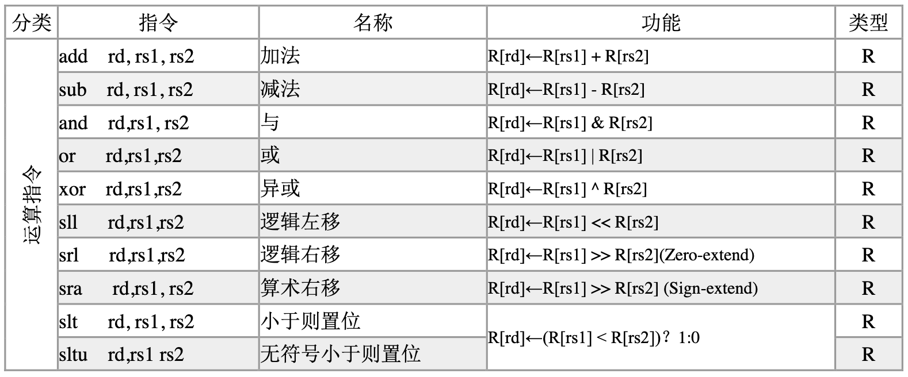
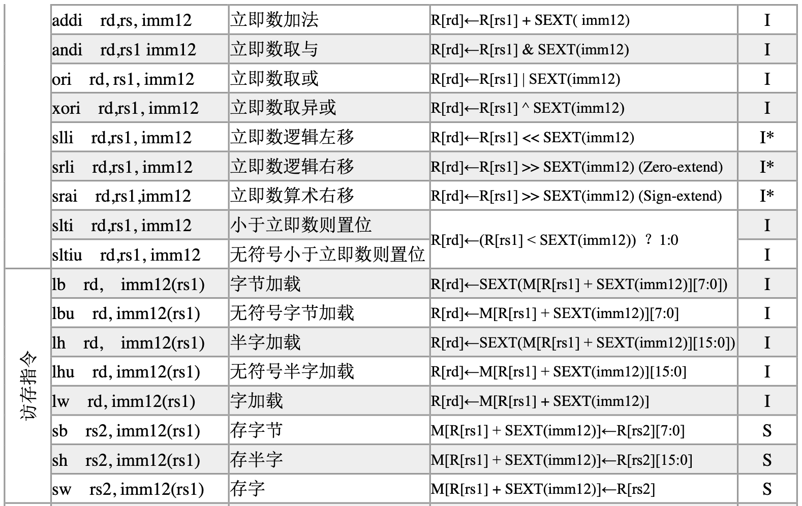

# 数字逻辑与计算机组成实验 第八次实验 单周期CPU设计实验 实验报告

> 211502008 李诚希
>
> chengxili@smail.nju.edu.cn

该实验的目标为设计一个指令存储器和数据存储器分离的单周期CPU，可以运行如下除系统调用外的RISCV32I子集：





## 模块设计

处理器整体设计如下：


具体来说，处理器会在时钟下降沿时读取指令，指令译码，取值计算结果，上升沿时内存输出开始有效，前半个周期的计算结果被写入寄存器堆的临时寄存器，同时nextPC被写入并开始输出下一条指令的位置；下一次下降沿到来时指令存储器从PC寄存器读取地址并输出有效指令，同时上一个周期的寄存器堆临时寄存器或数据存储器的输出被写入寄存器堆（由于寄存器堆是同步读取，该策略不会导致数据竞争）。从而CPU周而复始的运行。

### 指令存储器

由于指令地址必然是四字节对齐的，指令存储器以32bit为一单位，在时钟下降沿时输出对于输入地址有效，且不考虑写入：

```verilog
module ram_64k(
    output [31:0] dataout, 
    input Rclk,  
    input Wclk,  
    input [2:0] MemOp,  
    input [31:0] datain,  
    input [17:0] addr,  
    input we
);
// Add your code here
/* verilator lint_off WIDTHTRUNC */
    wire [3:0] we_W_T;
    reg [31:0] outreg;
    wire [31:0] out_valid_w;
    (* ram_style="block" *) reg [31:0] ram [2**16-1:0];
    initial begin
    // 使用$readmemh系统任务从.hex文件中读取数据到寄存器文件
        $readmemh("/Users/.../lab18e/testcase/Fibonacci.hex", ram);
    end  
    always @(negedge Rclk) begin
        outreg <= ram[addr >> 2];
    end
    wire [31:0] outwire;
    assign outwire = outreg;
    assign we_W_T = 
                MemOp == 3'b000 ? ((we == 1) ? 4'b0001 : 4'd0000) :
                MemOp == 3'b001 ? ((we == 1) ? 4'b0011 : 4'd0000) :
                MemOp == 3'b010 ? ((we == 1) ? 4'b1111 : 4'd0000) :
                MemOp == 3'b100 ? (4'd0000) :
                MemOp == 3'b101 ? (4'd0000) :
                0;
    always @(posedge Wclk) begin
        /* verilator lint_off CMPCONST */
        if (we && addr <= 2**16-1 && we_W_T[0] == 1) ram[addr >> 2] <= datain;
        /* verilator lint_on CMPCONST */
    end

    wire [31:0] outW_T;
    assign outW_T = outwire;
    assign dataout = 
                    MemOp == 3'b000 ? ({outW_T[7] == 1 ? 24'b111111111111111111111111 : 24'd0, outW_T[7:0]}) :
                    MemOp == 3'b001 ? ({outW_T[15] == 1 ? 16'b1111111111111111 : 16'd0, outW_T[15:0]}) :
                    MemOp == 3'b010 ? (outW_T[31:0]) :
                    MemOp == 3'b100 ? ({24'd0, outW_T[7:0]}) :
                    MemOp == 3'b101 ? ({16'd0, outW_T[15:0]}) :
                    0;
endmodule

```

### 数据存储器

直接使用上一个实验的数据存储器即可，同时read和write的时钟分离方便设计：

```verilog
module DataRam_64k(
    output [31:0] dataout, 
    input Rclk,  
    input Wclk,        
    input [2:0] MemOp,  
    input [31:0] datain,  
    input [17:0] addr,  
    input we
);

/* verilator lint_off WIDTHTRUNC */
    wire [3:0] we_W_T;
    reg [31:0] outreg;
    wire [31:0] out_valid_w;
    wire [31:0] outwire;
    wire [7:0] memwire [3:0];
    wire [3:0] memwe;
    wire [15:0] memaddr [3:0];
    wire [7:0] memdatain [3:0];
    mem8b mem_0(.dataout(memwire[0]), .datain(memdatain[0]), .we(memwe[0]), .addr(memaddr[0]), .Rclk(Rclk), .Wclk(Wclk));
    mem8b mem_1(.dataout(memwire[1]), .datain(memdatain[1]), .we(memwe[1]), .addr(memaddr[1]), .Rclk(Rclk), .Wclk(Wclk));
    mem8b mem_2(.dataout(memwire[2]), .datain(memdatain[2]), .we(memwe[2]), .addr(memaddr[2]), .Rclk(Rclk), .Wclk(Wclk));
    mem8b mem_3(.dataout(memwire[3]), .datain(memdatain[3]), .we(memwe[3]), .addr(memaddr[3]), .Rclk(Rclk), .Wclk(Wclk));
    assign memaddr[0] = (addr % 4 > 0) ? (addr >> 2) : (addr >> 2) + 1;
    assign memaddr[1] = (addr % 4 > 1) ? (addr >> 2) : (addr >> 2) + 1;
    assign memaddr[2] = (addr % 4 > 2) ? (addr >> 2) : (addr >> 2) + 1;
    assign memaddr[3] = (addr % 4 > 3) ? (addr >> 2) : (addr >> 2) + 1;
    assign outwire[7:0] = (addr % 4 == 0) ? memwire[0] :
                            (addr % 4 == 1) ? memwire[1] :
                            (addr % 4 == 2) ? memwire[2] :
                            memwire[3];
    assign outwire[15:8] = (addr % 4 == 0) ? memwire[1] :
                            (addr % 4 == 1) ? memwire[2] :
                            (addr % 4 == 2) ? memwire[3] :
                            memwire[0];
    assign outwire[23:16] = (addr % 4 == 0) ? memwire[2] :
                            (addr % 4 == 1) ? memwire[3] :
                            (addr % 4 == 2) ? memwire[0] :
                            memwire[1];
    assign outwire[31:24] = (addr % 4 == 0) ? memwire[3] :
                            (addr % 4 == 1) ? memwire[0] :
                            (addr % 4 == 2) ? memwire[1] :
                            memwire[2];

    assign memwe[0] = (addr % 4 == 0) ? we_W_T[0] : 
                        (addr % 4 == 1) ? we_W_T[3] :
                        (addr % 4 == 2) ? we_W_T[2] :
                        we_W_T[1];
    assign memwe[1] = (addr % 4 == 0) ? we_W_T[1] : 
                        (addr % 4 == 1) ? we_W_T[0] :
                        (addr % 4 == 2) ? we_W_T[3] :
                        we_W_T[2];  
    assign memwe[2] = (addr % 4 == 0) ? we_W_T[2] :
                        (addr % 4 == 1) ? we_W_T[1] :
                        (addr % 4 == 2) ? we_W_T[0] :
                        we_W_T[3];
    assign memwe[3] = (addr % 4 == 0) ? we_W_T[3] : 
                        (addr % 4 == 1) ? we_W_T[2] :
                        (addr % 4 == 2) ? we_W_T[1] :
                        we_W_T[0];
    assign memdatain[0] = (addr % 4 == 0) ? datain[7:0] :
                            (addr % 4 == 1) ? datain[31:24] :
                            (addr % 4 == 2) ? datain[23:16] :
                            datain[15:8];
    assign memdatain[1] = (addr % 4 == 0) ? datain[15:8] :
                            (addr % 4 == 1) ? datain[7:0] :
                            (addr % 4 == 2) ? datain[31:24] :
                            datain[23:16];
    assign memdatain[2] = (addr % 4 == 0) ? datain[23:16] :
                            (addr % 4 == 1) ? datain[15:8] :
                            (addr % 4 == 2) ? datain[7:0] :
                            datain[31:24];
    assign memdatain[3] = (addr % 4 == 0) ? datain[31:24] :
                            (addr % 4 == 1) ? datain[23:16] :
                            (addr % 4 == 2) ? datain[15:8] :
                            datain[7:0];
    /* verilator lint_off WIDTHTRUNC */
    assign we_W_T = 
                MemOp == 3'b000 ? ((we == 1) ? 4'b0001 : 4'd0000) :
                MemOp == 3'b001 ? ((we == 1) ? 4'b0011 : 4'd0000) :
                MemOp == 3'b010 ? ((we == 1) ? 4'b1111 : 4'd0000) :
                MemOp == 3'b100 ? (4'd0000) :
                MemOp == 3'b101 ? (4'd0000) :
                0;
  
    wire [31:0] outW_T;
    assign outW_T = outwire;
    assign dataout = 
                    MemOp == 3'b000 ? ({outW_T[7] == 1 ? 24'b111111111111111111111111 : 24'd0, outW_T[7:0]}) :
                    MemOp == 3'b001 ? ({outW_T[15] == 1 ? 16'b1111111111111111 : 16'd0, outW_T[15:0]}) :
                    MemOp == 3'b010 ? (outW_T[31:0]) :
                    MemOp == 3'b100 ? ({24'd0, outW_T[7:0]}) :
                    MemOp == 3'b101 ? ({16'd0, outW_T[15:0]}) :
                    0;
endmodule

module mem8b (
    output reg [7:0] dataout,
    input [7:0] datain,
    input we,
    input [15:0] addr,
    input Rclk,
    input Wclk
);
    (* ram_style="block" *) reg [7:0] data [2**15-1:0];
    always @(negedge Rclk)begin
        dataout <= data[addr];
    end
    always @(posedge Wclk) begin
        if(we) data[addr] <= datain;
    end
endmodule
```
### 指令译码器

### 控制器

### 寄存器堆

### 立即数扩展

### ALU

### CPU


## 仿真

同上一个实验，使用verilator+NVBoard进行仿真：


可见可以按照预期运行。

## 验证


综合并实现设计，发现存储器的确被综合为了block memory。

烧入FPGA：

在不同位置写入数据并关闭we，可以看到数据被存储在相应位置：


电路可以按照预期工作。

## 错误现象及分析

最初由于没有遵循block memory的要求给一个reg连接了4条线，导致reg无法被综合到block memory。

---

## 思考题

1、分别采用分布式 RAM 和块 RAM 实现存储器，通过仿真程序分析异步读和同步读的时序状态。

- 同步读取的输出会在addr信号更改后立即更改生效，异步读取需要在存储器时钟上升或下降后输出才有效

2、分析 Cache 大小对命中率的影响。

- cache越大命中率越高

3、当指令 Cache 和数据 Cache 独立实现时，如何设计顶层 Cache 的有限状态机。

- 无需特殊处理，因为指令和数据在cpu视角没有区别，都是内存的某一部分。
