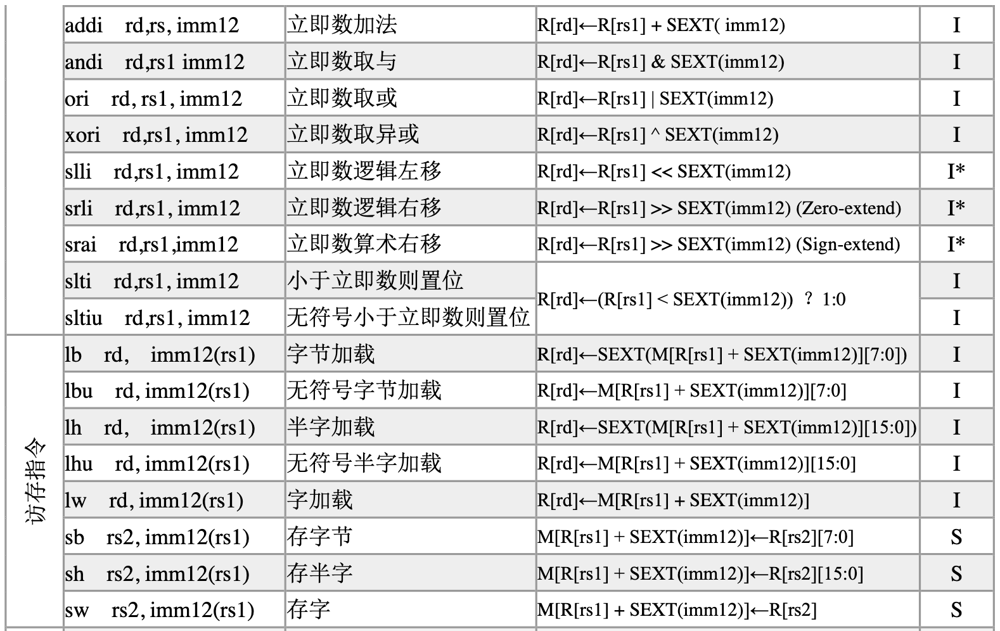
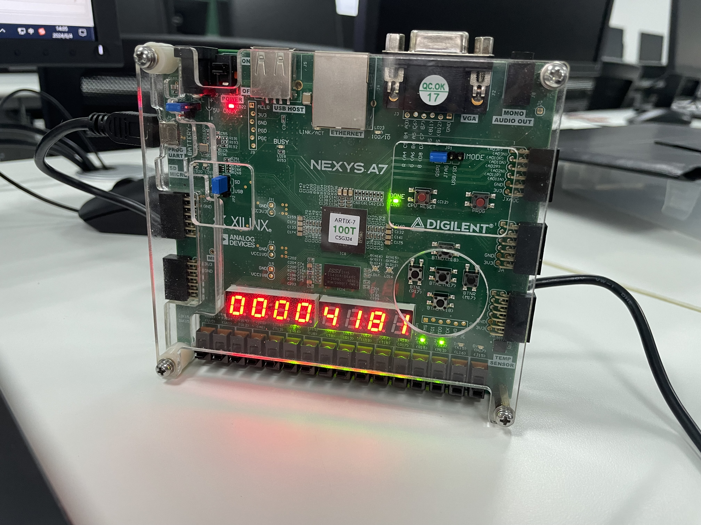

# 数字逻辑与计算机组成实验 第九次实验 五级流水线CPU设计实验 实验报告

> 211502008 李诚希
>
> chengxili@smail.nju.edu.cn

该实验使用之前的模块构造一个五级流水线CPU，支持如下指令集：




## 模块设计

处理器整体设计如下：


由于与单周期CPU共用大部分模块，在此只展示重写的部分。完整内容详见工程目录。

### 流水段寄存器

流水段寄存器用于存储每个流水段产生的，发送给下一个流水段的临时数据，并

1. `first_register`：这个模块定义了指令取值阶段（Fetch stage）的寄存器。它将程序计数器（PC）的值、指令以及PC加4的值寄存起来。此外，还有复位（rst）、时钟（clk）、暂停（StallD）和清空（FlushD）信号来控制寄存器的行为。
2. `Second_register`：这个模块定义了指令解码阶段（Decode

   stage）的寄存器。它寄存了指令解码阶段产生的各种控制信号和数据，例如寄存器写使能（RegWrite）、内存写使能（MemWrite）、跳转（Jump）、分支（Branch）等。它同样受到复位和时钟信号的控制，并且有一个清空信号（FlushE）来控制何时清空寄存器。
3. `third_register`：这个模块定义了执行阶段（Execute stage）到内存访问阶段（Memory stage）之间的寄存器。它寄存了执行阶段的结果，如ALU结果、写回数据、PC加4的值等，以及控制信号，这些信号决定数据是否应该写入寄存器或内存。
4. `fourth_register`：这个模块定义了内存访问阶段到写回阶段（Write-back stage）之间的寄存器。它寄存了内存访问阶段的数据，如ALU结果、从内存读取的数据、PC加4的值等，以及控制信号，这些信号用于控制数据在写回阶段的处理。

```verilog

`timescale 1ns/1ps

module first_register (
    input             clk,
    input             rst,
    input             StallD,
    input             FlushD,
    input      [31:0] instruction,
    input      [31:0] PCF,
    input      [31:0] PCPlus4F,
    output reg [31:0] instrD, 
    output reg [31:0] PCD,
    output reg [31:0] PCPlus4D
);
    always @(posedge clk) begin
        if (rst) begin
           instrD    <= 32'd0;
            PCD      <= 32'd0;
            PCPlus4D <= 32'd0;
        end
        else if (StallD) begin
            instrD   <= instrD;
            PCD      <= PCD;
            PCPlus4D <= PCPlus4D;
        end
        else if (FlushD) begin
            instrD   <= 32'd0;
            PCD      <= 32'd0;
            PCPlus4D <= 32'd0;
        end
        else begin
            instrD   <= instruction;
            PCD      <= PCF;
            PCPlus4D <= PCPlus4F;
        end
  
    end
  
endmodule

module Second_register (
    input [31:0]      PCD, 
    input [31:0]      ImmExtD,
    input [31:0]      PCPlus4D,
    input [31:0]      RD1,
    input [31:0]      RD2,
    input [4:0]       RdD,
    input [4:0]       Rs1D,
    input [4:0]       Rs2D,
    input [2:0]       funct3,
    input             rst,
    input             clk,
    input             RegWriteD,
    input             MemWriteD,
    input             JumpD,
    input             BranchD,
    input             ALUSrcD,
    input             ZeroE,
    input             FlushE,
    input [1:0]       ResultSrcD,
    input [4:0]       ALUControlD,
    output reg        RegWriteE,
    output reg        MemWriteE,
    output reg        JumpE,
    output reg        BranchE,
    output reg        ALUSrcE,
    output reg        PCSrcE,
    output reg [1:0]  ResultSrcE,
    output reg [4:0]  ALUControlE,
    output reg [31:0] PCE,
    output reg [31:0] ImmExtE,
    output reg [31:0] PCPlus4E,
    output reg [31:0] RD1E,
    output reg [31:0] RD2E,
    output reg [2:0]  funct3E,
    output reg [4:0]  RdE,
    output reg [4:0]  Rs1E,
    output reg [4:0]  Rs2E
);
    always @(posedge clk) begin
        if (rst) begin
            RegWriteE   <= 0;
            MemWriteE   <= 0;
            JumpE       <= 0;
            BranchE     <= 0;
            ALUSrcE     <= 0;
            ResultSrcE  <= 2'b00;
            ALUControlE <= 5'b00000;
            PCE         <= 32'd0;
            ImmExtE     <= 32'd0;
            PCPlus4E    <= 32'd0;
            RD1E        <= 32'd0;
            RD2E        <= 32'd0;
            funct3E     <= 3'd0;
            RdE         <= 5'd0;
            Rs1E        <= 5'd0;
            Rs2E        <= 5'd0;
        end
        else if (FlushE) begin
            RegWriteE   <= 0;
            MemWriteE   <= 0;
            JumpE       <= 0;
            BranchE     <= 0;
            ALUSrcE     <= 0;
            ResultSrcE  <= 2'b00;
            ALUControlE <= 5'b00000;
            PCE         <= 32'd0;
            ImmExtE     <= 32'd0;
            PCPlus4E    <= 32'd0;
            RD1E        <= 32'd0;
            RD2E        <= 32'd0;
            funct3E     <= 3'd0;
            RdE         <= 5'd0;
            Rs1E        <= 5'd0;
            Rs2E        <= 5'd0;
        end
        else begin
            RegWriteE   <= RegWriteD;
            MemWriteE   <= MemWriteD;
            JumpE       <= JumpD;
            BranchE     <= BranchD;
            ALUSrcE     <= ALUSrcD;
            ResultSrcE  <= ResultSrcD;
            ALUControlE <= ALUControlD;
            PCE         <= PCD;
            ImmExtE     <= ImmExtD;
            PCPlus4E    <= PCPlus4D;
            RD1E        <= RD1;
            RD2E        <= RD2;
            funct3E     <= funct3;
            RdE         <= RdD;
            Rs1E        <= Rs1D;
            Rs2E        <= Rs2D;
        end
  
    end
  
    always @(*) begin    //this is a combinational block, so block assignment should be used
        PCSrcE = (ZeroE && BranchE) || JumpE;
    end
  
endmodule

module third_register (
    input      [31:0] WriteDataE,
    input      [31:0] ALUResult,
    input      [31:0] PCPlus4E,
    input      [4:0]  RdE,
    input             clk,
    input             rst,
    input             RegWriteE,
    input             MemWriteE,
    input      [1:0]  ResultSrcE,
    output reg [31:0] ALUResultM,
    output reg [31:0] WriteDataM,
    output reg [31:0] PCPlus4M,
    output reg [4:0]  RdM,
    output reg        RegWriteM,
    output reg        MemWriteM,
    output reg [1:0]  ResultSrcM
);
    always @(posedge clk) begin
        if (rst) begin
           RegWriteM  <= 0;
           MemWriteM  <= 0;
           ResultSrcM <= 2'b00;
           ALUResultM <= 32'd0;
           WriteDataM <= 32'd0;
           RdM        <= 5'd0;
           PCPlus4M   <= 32'd0;
        end
        else begin
           RegWriteM  <= RegWriteE;
           MemWriteM  <= MemWriteE;
           ResultSrcM <= ResultSrcE;
           ALUResultM <= ALUResult;
           WriteDataM <= WriteDataE;
           RdM        <= RdE;
           PCPlus4M   <= PCPlus4E;
        end
    end
  
endmodule

module fourth_register (
    input      [31:0] ALUResultM,
    input      [31:0] ReadData,
    input      [31:0] PCPlus4M,
    input      [4:0]  RdM,
    input             rst,
    input             clk,
    input             RegWriteM,
    input      [1:0]  ResultSrcM,
    output reg [31:0] ALUResultW,
    output reg [31:0] ReadDataW,
    output reg [31:0] PCPlus4W,
    output reg [4:0]  RdW,
    output reg [1:0]  ResultSrcW,
    output reg        RegWriteW
);
    always @(posedge clk) begin
        if(rst) begin
            ALUResultW <= 32'd0;
            ReadDataW  <= 32'd0;
            PCPlus4W   <= 32'd0;
            RdW        <= 5'd0;
            ResultSrcW <= 2'd0;
            RegWriteW  <= 0; 
        end
        else begin
            ALUResultW <= ALUResultM;
            ReadDataW  <= ReadData;
            PCPlus4W   <= PCPlus4M;
            RdW        <= RdM;
            ResultSrcW <= ResultSrcM;
            RegWriteW  <= RegWriteM; 
        end

    end
  
endmodule
```

### 控制器

调整了控制器以适应流水线：

```verilog
module Controller (
    input      [6:0] OP,
    input      [6:0] funct77,
    input      [2:0] funct3,
    input            funct7,
    output reg       MemWriteD,
    output reg       ALUSrcD,
    output reg       RegWriteD,
    output reg       BranchD,
    output reg       JumpD, //PCSrc
    output reg [1:0] ResultSrcD,
    output reg [4:0] ALUControlD,
    output reg [2:0] ImmSrcD
);
  
    wire [16:0] checker;
    assign      checker = {{OP},{funct3},{funct77}};
    reg [1:0]   ALUOp;
    always @ (*) begin
        casex (OP)
            7'b0000011: begin        //lw
                BranchD    = 0;
                ResultSrcD = 2'b01;
                MemWriteD  = 0;
                ALUSrcD    = 1;
                RegWriteD  = 1;
                ALUOp      = 2'b00;
                ImmSrcD    = 3'b000;
                JumpD      = 0;
            end 

            7'b0100011: begin  //sw
                BranchD    = 0;
                ResultSrcD = 2'bxx;
                MemWriteD  = 1;
                ALUSrcD    = 1;
                RegWriteD  = 0;
                ALUOp      = 2'b00;
                ImmSrcD    = 3'b001;
                JumpD      = 0;
            end

            7'b0110011: begin  //R-type
                BranchD    = 0;
                ResultSrcD = 2'b00;
                MemWriteD  = 0;
                ALUSrcD    = 0;
                RegWriteD  = 1;
                ALUOp      = 2'b10;
                ImmSrcD    = 3'bxxx;
                JumpD      = 0;
            end

            7'b1100011: begin  //branch
                BranchD    = 1;
                ResultSrcD = 2'bxx;
                MemWriteD  = 0;
                ALUSrcD    = 0;
                RegWriteD  = 0;
                ALUOp      = 2'b01;
                ImmSrcD    = 3'b010;
                JumpD      = 0;
            end

            7'b0010011: begin  //I-Type
                BranchD    = 0;
                ResultSrcD = 2'b00;
                MemWriteD  = 0;
                ALUSrcD    = 1;
                RegWriteD  = 1;
                ALUOp      = 2'b10;
                ImmSrcD    = 3'b000;
                JumpD      = 0;
            end
            7'b1101111: begin //j
                BranchD    = 0;
                ResultSrcD = 2'b10;
                MemWriteD  = 0;
                ALUSrcD    = 1'bx;
                RegWriteD  = 1;
                ALUOp      = 2'bxx;
                ImmSrcD    = 3'b011;
                JumpD      = 1;
            end
            /*7'b0110111:begin //U-type
                BranchD <= 0;
                WE3 <= 1;
                ImmSrc <= 3'b100;
                ALUSrc <= 1;
                WE <= 0;
                ResultSrc <= 0;
                ALUOp <= 2'b00;
            end  */  
        
            default: begin
                BranchD    = 0;
                ResultSrcD = 2'b00;
                MemWriteD  = 0;
                ALUSrcD    = 1'bx;
                RegWriteD  = 0;
                ALUOp      = 2'b00;
                ImmSrcD    = 3'b000;
                JumpD      = 0;
            end 
    
        endcase
  
    end

    always @ (*) begin

        casex (checker)
            17'b01100110000000000: ALUControlD = 5'b00000;
            17'b01100110000100000: ALUControlD = 5'b00001;
            17'b01100110000000001: ALUControlD = 5'b00010;
            17'b01100111000000001: ALUControlD = 5'b00011;
            17'b01100111100000001: ALUControlD = 5'b00000; //rem defined wrong
            17'b01100111110000000: ALUControlD = 5'b01000;
            17'b01100111100000000: ALUControlD = 5'b01001;
            17'b01100111000000000: ALUControlD = 5'b01010;
            17'b01100110010000000: ALUControlD = 5'b00100; //sll,logical shift left
            17'b01100111010000000: ALUControlD = 5'b00101; //srl,logical shift right
            17'b0010011000xxxxxxx: ALUControlD = 5'b00000;
            17'b11000110001111111: ALUControlD = 5'b00001; //beq
            17'b1100011001xxxxxxx: ALUControlD = 5'b00001;
            17'b0000011010xxxxxxx: ALUControlD = 5'b00000;
            17'b0100011010xxxxxxx: ALUControlD = 5'b00000; 
            17'b0110111xxxxxxxxxx: ALUControlD = 5'b10000; //U-type
            default:               ALUControlD = 5'b00000;
        endcase
  
    end
endmodule
```

### 阻塞控制器

`hazard_unit`是用于处理流水线中的数据冒险和控制冒险的硬件单元。在流水线处理器中，数据冒险发生在一条指令需要使用前一条指令的结果作为其操作数时，而该结果尚未计算出来。控制冒险发生在分支指令后，需要根据分支结果决定是否跳过后续指令。

模块的输入包括各个流水线寄存器中的寄存器编号（如Rs1E, Rs2E, RdM等），以及一些控制信号（如RegWriteM, RegWriteW, PCSrcE等）。输出包括用于控制流水线的信号（如StallF, StallD, FlushE等）和用于数据前递的信号（如ForwardAE, ForwardBE）。

模块内部包含以下主要逻辑：

1. 数据前递逻辑（Forwarding
   Logic）：这部分逻辑决定是否需要将结果前递到执行阶段（EX）的输入端，以避免数据冒险。如果执行阶段的一个操作数依赖于上一个时钟周期的写回阶段（MEM）或当前时钟周期的写回阶段（WB）的结果，则相应的Forward信号会被设置，从而选择正确的数据源。
2. 暂停和清空逻辑（Stall
   and Flush
   Logic）：这部分逻辑用于处理数据冒险和控制冒险。如果存在数据冒险（如Load指令后紧跟的指令使用了Load指令的结果），则StallD信号会被置高，导致解码阶段（ID）和执行阶段（EX）暂停一个时钟周期。如果发生分支跳转或数据冒险导致需要清空执行阶段，则FlushE信号会被置高。StallF信号用于暂停取值阶段（IF），而FlushD信号用于清空解码阶段。

```verilog
module hazard_unit (
    input      [4:0] Rs1E,
    input      [4:0] Rs2E,
    input      [4:0] RdM,
    input      [4:0] RdW,
    input      [4:0] Rs1D,
    input      [4:0] Rs2D,
    input      [4:0] RdE,
    input      [1:0] ResultSrcE,
    input            RegWriteM,
    input            RegWriteW,
    input            PCSrcE,
    output reg       StallF,
    output reg       StallD,
    output reg       FlushE,
    output reg       FlushD,
    output reg [1:0] ForwardAE,
    output reg [1:0] ForwardBE
);
    reg lwStall;

    always @(*) begin
        if (((Rs1E == RdM) && RegWriteM) && (Rs1E != 0) ) begin
            ForwardAE = 2'b10;
        end
        else if ( ((Rs1E == RdW) && RegWriteW) && (Rs1E != 0) ) begin
            ForwardAE = 2'b01;
        end
        else begin
            ForwardAE = 2'b00;
        end
  
    end

    always @ (*) begin
        if (((Rs2E == RdM) && RegWriteM) && (Rs2E != 0) ) begin
            ForwardBE = 2'b10;
        end
        else if ( ((Rs2E == RdW) && RegWriteW) && (Rs2E != 0) ) begin
            ForwardBE = 2'b01;
        end
        else begin
            ForwardBE = 2'b00;
        end
  
    end

    always @ (*) begin
        lwStall = (ResultSrcE[0] & ((Rs1D == RdE) | (Rs2D == RdE)));
        StallD  = lwStall;
        FlushE  = lwStall | PCSrcE;
        StallF  = lwStall; 
        FlushD  = PCSrcE;
    end

endmodule
```

### CPU

将上述模块按需链接：

```verilog
`timescale 1ns/1ps

module PiplineCPU (
	output [31:0] InstrMemaddr,        // ָ���?����ַ
	input  [31:0] InstrMemdataout,     // ָ������
	output        InstrMemclk,         // ָ���?����ȡʱ�ӣ�Ϊ��ʵ���첽��ȡ�����ö�ȡʱ�Ӻ�д��ʱ�ӷ���
	output [31:0] DataMemaddr,         // ���ݴ洢����ַ
	input  [31:0] DataMemdataout,      // ���ݴ洢���������?
	output [31:0] DataMemdatain,       // ���ݴ洢��д������
	output 	      DataMemrdclk,        // ���ݴ洢����ȡʱ�ӣ�Ϊ��ʵ���첽��ȡ�����ö�ȡʱ�Ӻ�д��ʱ�ӷ���
	output	      DataMemwrclk,        // ���ݴ洢��д��ʱ��
	output [2:0]  DataMemop,           // ���ݶ�д�ֽ��������ź�
	output        DataMemwe,           // ���ݴ洢��д��ʹ���ź�
	output [15:0] dbgdata,              // debug�����źţ����?16λָ���?����ַ��Ч��ַ
    input clk,
    input rst
);
    wire [31:0] PCF;
    wire [31:0] PCPlus4F, instrD, PCD, PCPlus4D, SrcAE;
    wire [4:0]  A1, A2, RdD, RdW, RdE, RdM, Rs1E, Rs2E, Rs1D, Rs2D;
    wire [6:0]  OP;
    wire [2:0]  funct3, funct3E;
    wire        funct7;
    wire        WE3;
    wire        RegWriteW;
    wire        RegWriteD;
    wire        MemWriteD;
    wire        JumpD;
    wire        BranchD;
    wire        ALUSrcD;
    wire        ZeroE;
    wire        RegWriteE;
    wire        MemWriteE, JumpE, BranchE, ALUSrcE, PCSrcE;

    wire [24:0] Imm;
    wire [6:0]  funct77;
    wire [31:0] ResultW, RD1, RD2;
    wire [31:0] ImmExtD;
    wire [2:0]  ImmSrcD;
    wire [1:0]  ResultSrcD, ResultSrcE, ResultSrcM, ResultSrcW;
    wire [4:0]  ALUControlD, ALUControlE;
    wire [31:0] RD1E, RD2E, PCE, ImmExtE, PCPlus4E;
    wire [31:0] PCTargetE;
    wire [31:0] SrcBE;
    wire [31:0] ALUResult, ALUResultM, ALUResultW;
    wire [31:0] WriteDataM, PCPlus4M, PCPlus4W;
    wire        CarryOut, RegWriteM, MemWriteM;
    wire [31:0] ReadData, ReadDataW, WriteDataE ;
    wire [1:0]  ForwardAE, ForwardBE;
    wire        StallF, StallD, FlushE, FlushD;


    nextPC nextPC (
        .rst      (rst      ),
        .clk      (clk      ),
        .PCSrcE   (PCSrcE   ),
        .StallF   (StallF   ),
        .PCPlus4F (PCPlus4F ),
        .PCTargetE(PCTargetE),
        .PCF      (PCF      )
    );
    assign InstrMemaddr = PCF;
    assign instruction = InstrMemdataout;
    assign InstrMemclk = ~clk;

    first_register i_1 (
        .clk        (clk        ),
        .rst        (rst        ),
        .StallD     (StallD     ),
        .FlushD     (FlushD     ),
        .instruction(instruction),
        .PCF        (PCF        ),
        .PCPlus4F   (PCPlus4F   ),
        .instrD     (instrD     ),
        .PCD        (PCD        ),
        .PCPlus4D   (PCPlus4D   )
    );

    reg [31:0] PCPlus4F_R;
    assign PCPlus4F = PCPlus4F_R;
    always @(PCF) begin
        PCPlus4F_R = PCF + 4;
    end

    reg [4:0] A1_r;
    reg [4:0] A2_r;
    reg [4:0] RdD_r;
    reg [4:0] OP_r;
    reg [4:0] funct3_r;
    reg [4:0] funct7_r;
    reg [4:0] Imm_r;
    reg [4:0] funct77_r;
    reg [4:0] Rs1D_r;
    reg [4:0] Rs2D_r;

    assign A1 = A1_r;
    assign A2 = A2_r;
    assign RdD = RdD_r;
    assign OP = OP_r;
    assign funct3 = funct3_r;
    assign funct7 = funct7_r;
    assign Imm = Imm_r;
    assign funct77 = funct77_r;
    assign Rs1D = Rs1D_r;
    assign Rs2D = Rs2D_r;
  
    always @ instrD begin
        A1_r      = instrD[19:15];
        A2_r      = instrD[24:20];
        RdD_r     = instrD[11:7];
        O_rP      = instrD[6:0];
        funct3_r  = instrD[14:12];
        funct7_r  = instrD[30];
        Imm_r     = instrD[31:7];
        funct77_r = instrD[31:25];
        Rs1D_r    = instrD[19:15];
        Rs2D_r    = instrD[24:20];
    end

    myregfile Register_File(
		.busa(RD1),   		//�Ĵ���ra�������?
		.busb(RD2),   		//�Ĵ���rb�������?
		.clk(~clk),
		.ra(A1),           	//���Ĵ������ra
		.rb(A2),          	//���Ĵ������rb
		.rw(RdW),          		//д�Ĵ������rw
		.busw(ResultW),       	//д�����ݶ˿�
		.we(RegWriteW)	            //дʹ�ܶˣ�Ϊ1ʱ����д��
	);
  
    InstrToImm MyImm(
		.instr({Imm_r, 7'd0}),   		//32λָ��
		.ExtOp(ImmSrcD),    		//��չ������
		.imm(ImmExtD)
	);

    Second_register i_2(
        .PCD         (PCD        ),
        .ImmExtD     (ImmExtD    ),
        .PCPlus4D    (PCPlus4D   ),
        .RD1         (RD1        ),
        .RD2         (RD2        ),
        .RdD         (RdD        ),
        .Rs1D        (Rs1D       ),
        .Rs2D        (Rs2D       ),
        .funct3      (funct3     ),
        .rst         (rst        ),
        .clk         (clk        ),
        .RegWriteD   (RegWriteD  ),
        .MemWriteD   (MemWriteD  ),
        .JumpD       (JumpD      ),
        .BranchD     (BranchD    ),
        .ALUSrcD     (ALUSrcD    ),
        .ZeroE       (ZeroE      ),
        .FlushE      (FlushE     ),
        .ResultSrcD  (ResultSrcD ),
        .ALUControlD (ALUControlD),
        .RegWriteE   (RegWriteE  ),
        .MemWriteE   (MemWriteE  ),
        .JumpE       (JumpE      ),
        .BranchE     (BranchE    ),
        .ALUSrcE     (ALUSrcE    ),
        .PCSrcE      (PCSrcE     ),
        .ResultSrcE  (ResultSrcE ),
        .ALUControlE (ALUControlE),
        .PCE         (PCE        ),
        .ImmExtE     (ImmExtE    ),
        .PCPlus4E    (PCPlus4E   ),
        .RD1E        (RD1E       ),
        .RD2E        (RD2E       ),
        .funct3E     (funct3E    ),
        .RdE         (RdE        ),
        .Rs1E        (Rs1E       ),
        .Rs2E        (Rs2E       )
    );
    reg [31:0] PCTargetE_R;
    assign PCTargetE = PCTargetE_R;
    always @ (PCE, ImmExtE) begin
        PCTargetE_R = PCE + ImmExtE;    
    end

    assign SrcBE = ALUSrcE ?  ImmExtE : WriteDataE;
    wire ZeroE_emp;
    ALU32 i_alu(
        .result(ALUResult),      //32�����
        .zero(ZeroE_emp),               //����?0��־λ
        .dataa(SrcAE),      //32λ�������룬�͵�ALU�˿�A   
        .datab(SrcBE),      //32λ�������룬�͵�ALU�˿�B  
        .aluctr(ALUControlE)      //4λALU���������ź�
    ); 
    reg ZeroE_R;
    assign ZeroE = ZeroE_R;
    always @ (*) 
        begin
            case(funct3E)
            3'b000:   ZeroE_R =  SrcAE == SrcBE; //beq
            3'b001:   ZeroE_R =  SrcAE != SrcBE; //bne
            3'b100:   ZeroE_R =  SrcAE < SrcBE;  //blt
            3'b101:   ZeroE_R =  SrcAE > SrcBE;  //bge
            3'b110:   ZeroE_R =  SrcAE < SrcBE;  //bltu
            3'b111:   ZeroE_R =  SrcAE >= SrcBE; //bgeu
            default : ZeroE_R =  0;
	   endcase
	end

    third_register i_3 (
        .WriteDataE (WriteDataE),
        .ALUResult  (ALUResult ),
        .PCPlus4E   (PCPlus4E  ),
        .RdE        (RdE       ),
        .clk        (clk       ),
        .rst        (rst       ),
        .RegWriteE  (RegWriteE ),
        .MemWriteE  (MemWriteE ),
        .ResultSrcE (ResultSrcE),
        .ALUResultM (ALUResultM),
        .WriteDataM (WriteDataM),
        .PCPlus4M   (PCPlus4M  ),
        .RdM        (RdM       ),
        .RegWriteM  (RegWriteM ),
        .MemWriteM  (MemWriteM ),
        .ResultSrcM (ResultSrcM)
    );
    assign DataMemaddr = ALUResultM;
    assign Datamemdatain = WriteDataM;
    assign DataMemrdclk = clk;
    assign ReadData = DataMemdataout;
    assign DataMemwe = MemWriteM;


    fourth_register i_4 (
        .ALUResultM (ALUResultM),
        .ReadData   (ReadData  ),
        .PCPlus4M   (PCPlus4M  ),
        .RdM        (RdM       ),
        .rst        (rst       ),
        .clk        (clk       ),
        .RegWriteM  (RegWriteM ),
        .ResultSrcM (ResultSrcM),
        .ALUResultW (ALUResultW),
        .ReadDataW  (ReadDataW ),
        .PCPlus4W   (PCPlus4W  ),
        .RdW        (RdW       ),
        .ResultSrcW (ResultSrcW),
        .RegWriteW  (RegWriteW )
    );

    assign ResultW = ResultSrcW[1] ? PCPlus4W : (ResultSrcW[0] ? ReadDataW : ALUResultW);

    Controller i_c (
        .OP          (OP         ),
        .funct77     (funct77    ),
        .funct3      (funct3     ),
        .funct7      (funct7     ),
        .MemWriteD   (MemWriteD  ),
        .ALUSrcD     (ALUSrcD    ),
        .RegWriteD   (RegWriteD  ),
        .BranchD     (BranchD    ),
        .JumpD       (JumpD      ),
        .ResultSrcD  (ResultSrcD ),
        .ALUControlD (ALUControlD),
        .ImmSrcD     (ImmSrcD    )
    );

    hazard_unit i_hu (
        .Rs1E      (Rs1E      ),
        .Rs2E      (Rs2E      ),
        .RdM       (RdM       ),
        .RdW       (RdW       ),
        .Rs1D      (Rs1D      ),
        .Rs2D      (Rs2D      ),
        .RdE       (RdE       ),
        .ResultSrcE(ResultSrcE),
        .RegWriteM (RegWriteM ),
        .RegWriteW (RegWriteW ),
        .PCSrcE    (PCSrcE    ),
        .StallF    (StallF    ),
        .StallD    (StallD    ),
        .FlushE    (FlushE    ),
        .FlushD    (FlushD    ),
        .ForwardAE (ForwardAE ),
        .ForwardBE (ForwardBE )
    );

    assign SrcAE = ForwardAE[1] ? ALUResultM : (ForwardAE[0] ? ResultW : RD1E);

    assign WriteDataE = ForwardBE[1] ? ALUResultM : (ForwardBE[0] ? ResultW : RD2E);
endmodule
```

## 仿真

首先使用tb脚本测试，脚本运行后没有报错。

使用lab8的测试程序进行测试：

同上一个实验，使用verilator+NVBoard进行仿真：


可见可以按照预期运行。

> 注：在我上传的目录根目录下先使用export NVBOARD_HOME=...设置NVBOARD_HOME然后再make run即可进行仿真。

## 验证

综合并实现设计。

烧入FPGA：



电路可以按照预期工作，并正确运行计算斐波那契数列的程序。

## 错误现象及分析

暂无。

---

## 思考题

1、如何添加中断与CSR寄存器支持。

中断到来时清空所有流水段寄存器即可。

2、简述高级流水线设计方法。

根据我在网络上查找的资料，设计高级流水线时，需要考虑以下几个关键步骤和原则：

1. **确定流水线的深度** ：流水线的深度应根据电路的复杂性和性能要求来确定。不是所有的电路都适合深流水线，因为深流水线可能会增加延迟和硬件成本
2. **划分流水线阶段** ：将电路的功能逻辑合理划分为多个阶段，每个阶段完成一部分工作，并在阶段之间插入寄存器以存储中间结果。这有助于提高电路的工作频率和吞吐率
3. **平衡各阶段的工作量** ：为了最大化流水线的效率，每个阶段的工作量应该尽量平衡，避免某个阶段成为瓶颈
4. **处理数据依赖性** ：在设计流水线时，必须考虑数据之间的依赖关系，并采取措施如数据前递（data forwarding）或暂停（stalling）来处理这些依赖性
5. **优化时钟周期** ：通过调整寄存器之间的组合逻辑，优化每个流水线阶段的时钟周期，使其尽可能短，从而提高整体电路的频率
6. **考虑流水线冲刷** ：在设计支持分支预测的流水线时，需要考虑错误预测时的流水线冲刷（pipeline flush），以及如何快速恢复正确的执行路径
7. **降低功耗和面积** ：虽然流水线可以提高性能，但也会增加硬件成本和功耗。设计时应考虑如何在不牺牲性能的情况下，尽量减少功耗和芯片面积
8. **进行时序分析** ：确保流水线设计满足时序要求，特别是在高频操作下，需要仔细分析和优化每个阶段的时序
9. **模拟和验证** ：在实际硬件实现之前，使用仿真工具对流水线设计进行模拟和验证，确保设计的正确性和性能符合预期

3、如何设计更多流水段的CPU

将比较长的组合逻辑电路再做拆分即可。
