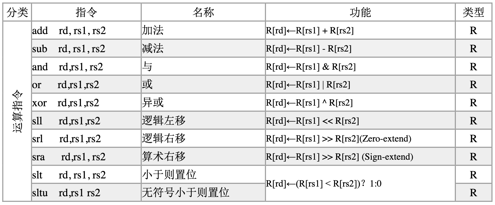
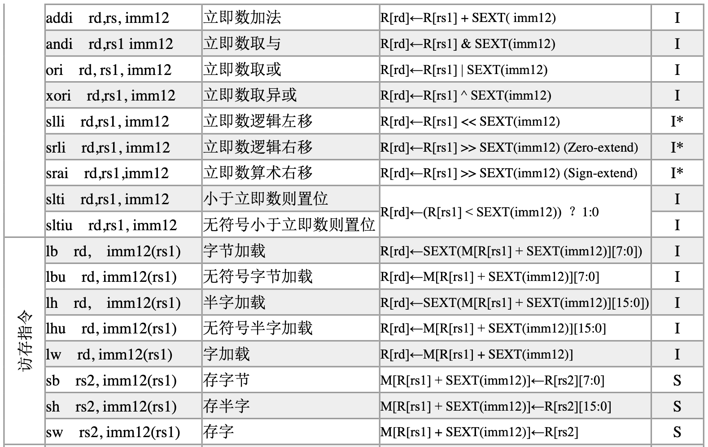
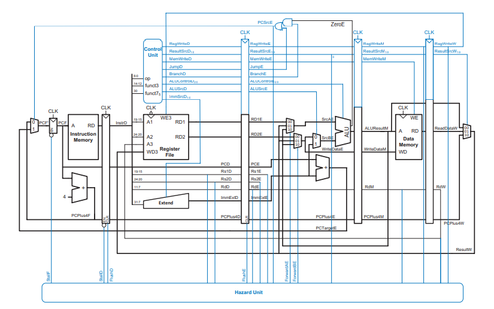
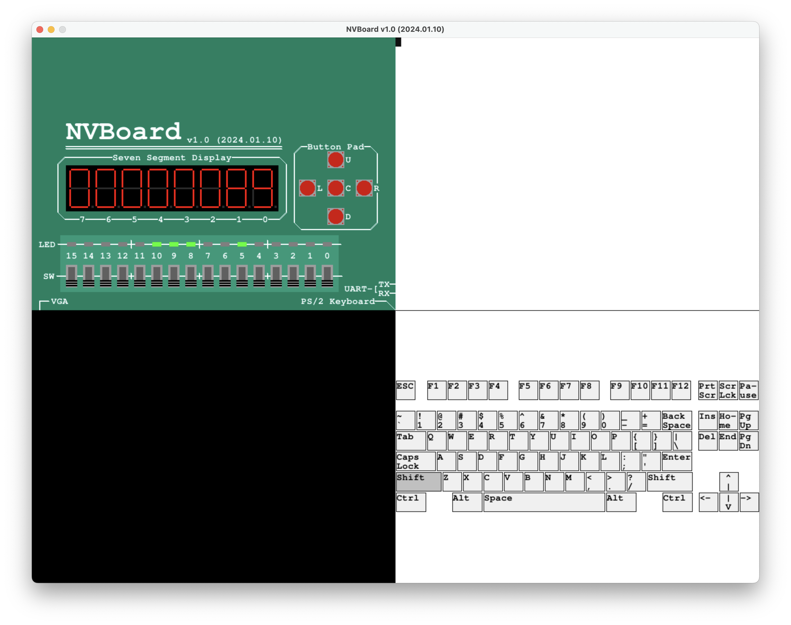
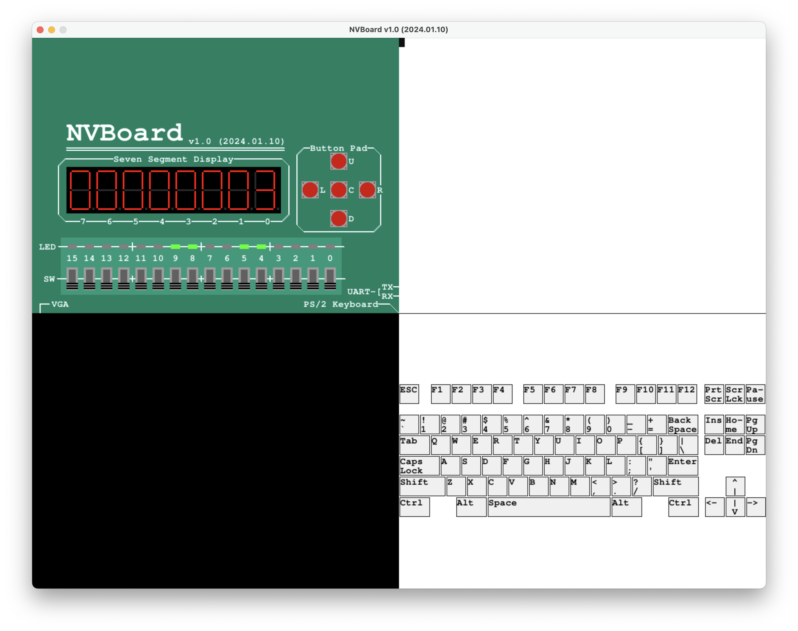
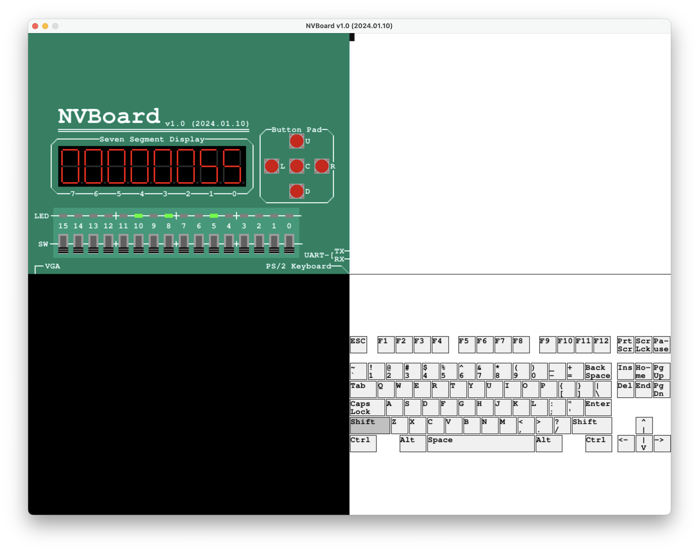
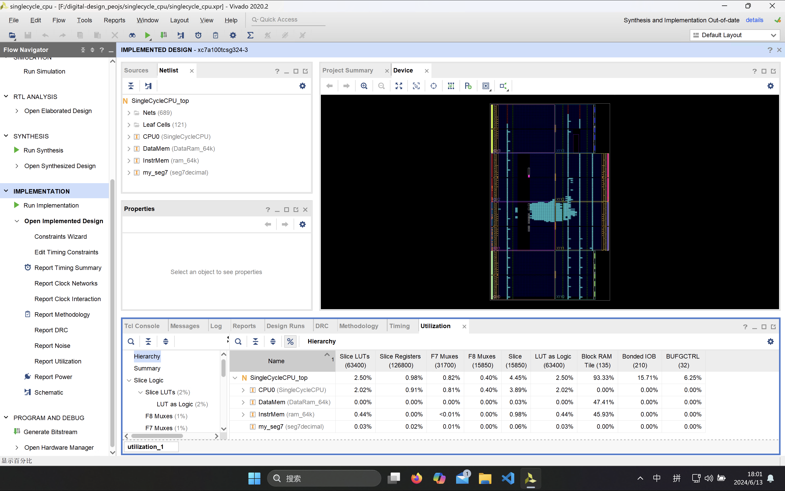
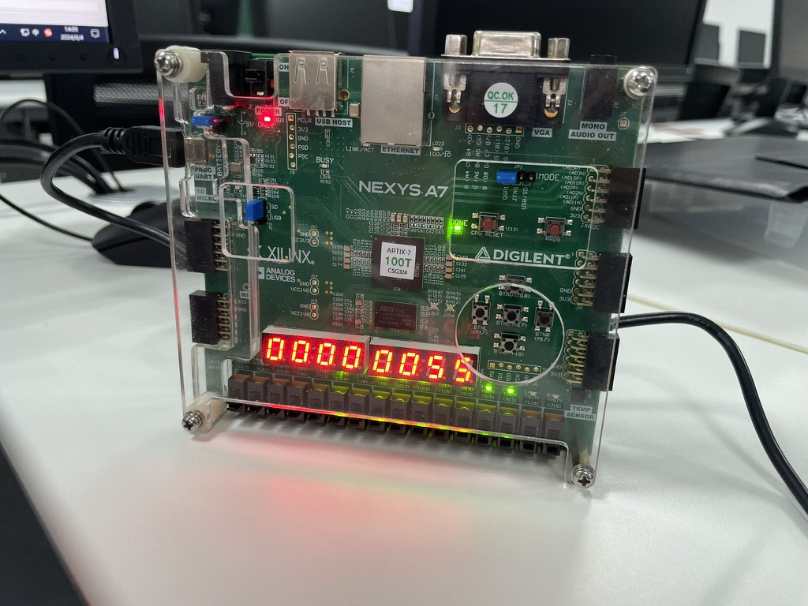
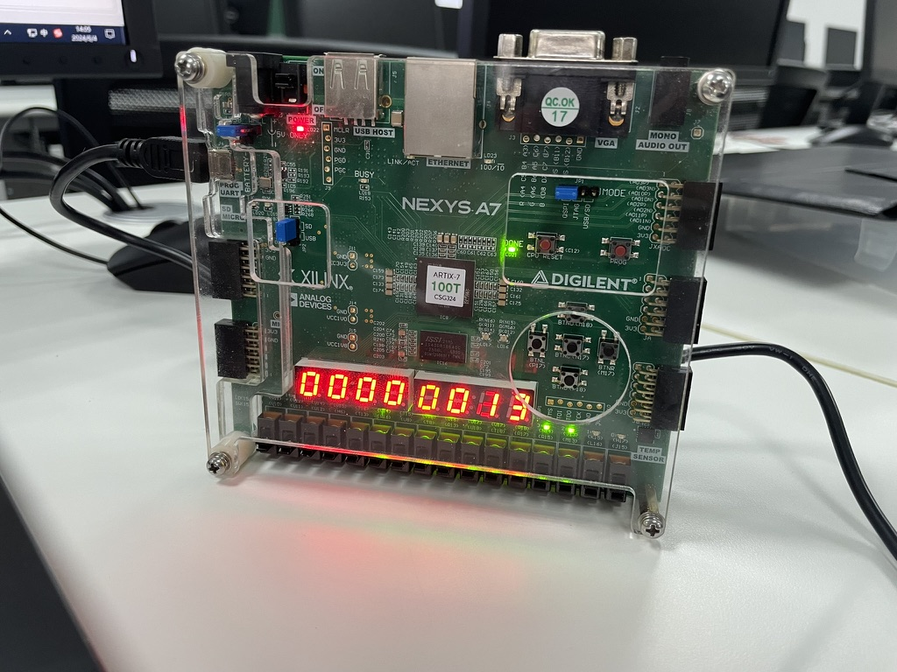

# 数字逻辑与计算机组成实验 第九次实验 五级流水线CPU设计实验 实验报告

> 211502008 李诚希
>
> chengxili@smail.nju.edu.cn

该试验使用之前的模块构造一个五级流水线CPU，支持如下指令集：





## 模块设计

处理器整体设计如下：



由于与单周期CPU共用大部分模块，在此只展示重写的部分。完整内容详见工程目录。

### 流水段寄存器

流水段寄存器用于存储每个流水段产生的，发送给下一个流水段的临时数据，并

1. `first_register`：这个模块定义了指令取值阶段（Fetch stage）的寄存器。它将程序计数器（PC）的值、指令以及PC加4的值寄存起来。此外，还有复位（rst）、时钟（clk）、暂停（StallD）和清空（FlushD）信号来控制寄存器的行为。
2. `Second_register`：这个模块定义了指令解码阶段（Decode

   stage）的寄存器。它寄存了指令解码阶段产生的各种控制信号和数据，例如寄存器写使能（RegWrite）、内存写使能（MemWrite）、跳转（Jump）、分支（Branch）等。它同样受到复位和时钟信号的控制，并且有一个清空信号（FlushE）来控制何时清空寄存器。
3. `third_register`：这个模块定义了执行阶段（Execute stage）到内存访问阶段（Memory stage）之间的寄存器。它寄存了执行阶段的结果，如ALU结果、写回数据、PC加4的值等，以及控制信号，这些信号决定数据是否应该写入寄存器或内存。
4. `fourth_register`：这个模块定义了内存访问阶段到写回阶段（Write-back stage）之间的寄存器。它寄存了内存访问阶段的数据，如ALU结果、从内存读取的数据、PC加4的值等，以及控制信号，这些信号用于控制数据在写回阶段的处理。

```verilog

`timescale 1ns/1ps

module first_register (
    input             clk,
    input             rst,
    input             StallD,
    input             FlushD,
    input      [31:0] instruction,
    input      [31:0] PCF,
    input      [31:0] PCPlus4F,
    output reg [31:0] instrD, 
    output reg [31:0] PCD,
    output reg [31:0] PCPlus4D
);
    always @(posedge clk) begin
        if (rst) begin
           instrD    <= 32'd0;
            PCD      <= 32'd0;
            PCPlus4D <= 32'd0;
        end
        else if (StallD) begin
            instrD   <= instrD;
            PCD      <= PCD;
            PCPlus4D <= PCPlus4D;
        end
        else if (FlushD) begin
            instrD   <= 32'd0;
            PCD      <= 32'd0;
            PCPlus4D <= 32'd0;
        end
        else begin
            instrD   <= instruction;
            PCD      <= PCF;
            PCPlus4D <= PCPlus4F;
        end
  
    end
  
endmodule

module Second_register (
    input [31:0]      PCD, 
    input [31:0]      ImmExtD,
    input [31:0]      PCPlus4D,
    input [31:0]      RD1,
    input [31:0]      RD2,
    input [4:0]       RdD,
    input [4:0]       Rs1D,
    input [4:0]       Rs2D,
    input [2:0]       funct3,
    input             rst,
    input             clk,
    input             RegWriteD,
    input             MemWriteD,
    input             JumpD,
    input             BranchD,
    input             ALUSrcD,
    input             ZeroE,
    input             FlushE,
    input [1:0]       ResultSrcD,
    input [4:0]       ALUControlD,
    output reg        RegWriteE,
    output reg        MemWriteE,
    output reg        JumpE,
    output reg        BranchE,
    output reg        ALUSrcE,
    output reg        PCSrcE,
    output reg [1:0]  ResultSrcE,
    output reg [4:0]  ALUControlE,
    output reg [31:0] PCE,
    output reg [31:0] ImmExtE,
    output reg [31:0] PCPlus4E,
    output reg [31:0] RD1E,
    output reg [31:0] RD2E,
    output reg [2:0]  funct3E,
    output reg [4:0]  RdE,
    output reg [4:0]  Rs1E,
    output reg [4:0]  Rs2E
);
    always @(posedge clk) begin
        if (rst) begin
            RegWriteE   <= 0;
            MemWriteE   <= 0;
            JumpE       <= 0;
            BranchE     <= 0;
            ALUSrcE     <= 0;
            ResultSrcE  <= 2'b00;
            ALUControlE <= 5'b00000;
            PCE         <= 32'd0;
            ImmExtE     <= 32'd0;
            PCPlus4E    <= 32'd0;
            RD1E        <= 32'd0;
            RD2E        <= 32'd0;
            funct3E     <= 3'd0;
            RdE         <= 5'd0;
            Rs1E        <= 5'd0;
            Rs2E        <= 5'd0;
        end
        else if (FlushE) begin
            RegWriteE   <= 0;
            MemWriteE   <= 0;
            JumpE       <= 0;
            BranchE     <= 0;
            ALUSrcE     <= 0;
            ResultSrcE  <= 2'b00;
            ALUControlE <= 5'b00000;
            PCE         <= 32'd0;
            ImmExtE     <= 32'd0;
            PCPlus4E    <= 32'd0;
            RD1E        <= 32'd0;
            RD2E        <= 32'd0;
            funct3E     <= 3'd0;
            RdE         <= 5'd0;
            Rs1E        <= 5'd0;
            Rs2E        <= 5'd0;
        end
        else begin
            RegWriteE   <= RegWriteD;
            MemWriteE   <= MemWriteD;
            JumpE       <= JumpD;
            BranchE     <= BranchD;
            ALUSrcE     <= ALUSrcD;
            ResultSrcE  <= ResultSrcD;
            ALUControlE <= ALUControlD;
            PCE         <= PCD;
            ImmExtE     <= ImmExtD;
            PCPlus4E    <= PCPlus4D;
            RD1E        <= RD1;
            RD2E        <= RD2;
            funct3E     <= funct3;
            RdE         <= RdD;
            Rs1E        <= Rs1D;
            Rs2E        <= Rs2D;
        end
  
    end
  
    always @(*) begin    //this is a combinational block, so block assignment should be used
        PCSrcE = (ZeroE && BranchE) || JumpE;
    end
  
endmodule

module third_register (
    input      [31:0] WriteDataE,
    input      [31:0] ALUResult,
    input      [31:0] PCPlus4E,
    input      [4:0]  RdE,
    input             clk,
    input             rst,
    input             RegWriteE,
    input             MemWriteE,
    input      [1:0]  ResultSrcE,
    output reg [31:0] ALUResultM,
    output reg [31:0] WriteDataM,
    output reg [31:0] PCPlus4M,
    output reg [4:0]  RdM,
    output reg        RegWriteM,
    output reg        MemWriteM,
    output reg [1:0]  ResultSrcM
);
    always @(posedge clk) begin
        if (rst) begin
           RegWriteM  <= 0;
           MemWriteM  <= 0;
           ResultSrcM <= 2'b00;
           ALUResultM <= 32'd0;
           WriteDataM <= 32'd0;
           RdM        <= 5'd0;
           PCPlus4M   <= 32'd0;
        end
        else begin
           RegWriteM  <= RegWriteE;
           MemWriteM  <= MemWriteE;
           ResultSrcM <= ResultSrcE;
           ALUResultM <= ALUResult;
           WriteDataM <= WriteDataE;
           RdM        <= RdE;
           PCPlus4M   <= PCPlus4E;
        end
    end
  
endmodule

module fourth_register (
    input      [31:0] ALUResultM,
    input      [31:0] ReadData,
    input      [31:0] PCPlus4M,
    input      [4:0]  RdM,
    input             rst,
    input             clk,
    input             RegWriteM,
    input      [1:0]  ResultSrcM,
    output reg [31:0] ALUResultW,
    output reg [31:0] ReadDataW,
    output reg [31:0] PCPlus4W,
    output reg [4:0]  RdW,
    output reg [1:0]  ResultSrcW,
    output reg        RegWriteW
);
    always @(posedge clk) begin
        if(rst) begin
            ALUResultW <= 32'd0;
            ReadDataW  <= 32'd0;
            PCPlus4W   <= 32'd0;
            RdW        <= 5'd0;
            ResultSrcW <= 2'd0;
            RegWriteW  <= 0; 
        end
        else begin
            ALUResultW <= ALUResultM;
            ReadDataW  <= ReadData;
            PCPlus4W   <= PCPlus4M;
            RdW        <= RdM;
            ResultSrcW <= ResultSrcM;
            RegWriteW  <= RegWriteM; 
        end

    end
  
endmodule
```

### 数据存储器

直接使用上一个实验的数据存储器即可，同时read和write的时钟分离方便设计：

```verilog
module DataRam_64k(
    output [31:0] dataout, 
    input Rclk,  
    input Wclk,  
    input [2:0] MemOp,  
    input [31:0] datain,  
    input [17:0] addr,  
    input we
);

/* verilator lint_off WIDTHTRUNC */
    wire [3:0] we_W_T;
    reg [31:0] outreg;
    wire [31:0] out_valid_w;
    wire [31:0] outwire;
    wire [7:0] memwire [3:0];
    wire [3:0] memwe;
    wire [15:0] memaddr [3:0];
    wire [7:0] memdatain [3:0];
    mem8b mem_0(.dataout(memwire[0]), .datain(memdatain[0]), .we(memwe[0]), .addr(memaddr[0]), .Rclk(Rclk), .Wclk(Wclk));
    mem8b mem_1(.dataout(memwire[1]), .datain(memdatain[1]), .we(memwe[1]), .addr(memaddr[1]), .Rclk(Rclk), .Wclk(Wclk));
    mem8b mem_2(.dataout(memwire[2]), .datain(memdatain[2]), .we(memwe[2]), .addr(memaddr[2]), .Rclk(Rclk), .Wclk(Wclk));
    mem8b mem_3(.dataout(memwire[3]), .datain(memdatain[3]), .we(memwe[3]), .addr(memaddr[3]), .Rclk(Rclk), .Wclk(Wclk));
    assign memaddr[0] = (addr % 4 > 0) ? (addr >> 2) : (addr >> 2) + 1;
    assign memaddr[1] = (addr % 4 > 1) ? (addr >> 2) : (addr >> 2) + 1;
    assign memaddr[2] = (addr % 4 > 2) ? (addr >> 2) : (addr >> 2) + 1;
    assign memaddr[3] = (addr % 4 > 3) ? (addr >> 2) : (addr >> 2) + 1;
    assign outwire[7:0] = (addr % 4 == 0) ? memwire[0] :
                            (addr % 4 == 1) ? memwire[1] :
                            (addr % 4 == 2) ? memwire[2] :
                            memwire[3];
    assign outwire[15:8] = (addr % 4 == 0) ? memwire[1] :
                            (addr % 4 == 1) ? memwire[2] :
                            (addr % 4 == 2) ? memwire[3] :
                            memwire[0];
    assign outwire[23:16] = (addr % 4 == 0) ? memwire[2] :
                            (addr % 4 == 1) ? memwire[3] :
                            (addr % 4 == 2) ? memwire[0] :
                            memwire[1];
    assign outwire[31:24] = (addr % 4 == 0) ? memwire[3] :
                            (addr % 4 == 1) ? memwire[0] :
                            (addr % 4 == 2) ? memwire[1] :
                            memwire[2];

    assign memwe[0] = (addr % 4 == 0) ? we_W_T[0] : 
                        (addr % 4 == 1) ? we_W_T[3] :
                        (addr % 4 == 2) ? we_W_T[2] :
                        we_W_T[1];
    assign memwe[1] = (addr % 4 == 0) ? we_W_T[1] : 
                        (addr % 4 == 1) ? we_W_T[0] :
                        (addr % 4 == 2) ? we_W_T[3] :
                        we_W_T[2];  
    assign memwe[2] = (addr % 4 == 0) ? we_W_T[2] :
                        (addr % 4 == 1) ? we_W_T[1] :
                        (addr % 4 == 2) ? we_W_T[0] :
                        we_W_T[3];
    assign memwe[3] = (addr % 4 == 0) ? we_W_T[3] : 
                        (addr % 4 == 1) ? we_W_T[2] :
                        (addr % 4 == 2) ? we_W_T[1] :
                        we_W_T[0];
    assign memdatain[0] = (addr % 4 == 0) ? datain[7:0] :
                            (addr % 4 == 1) ? datain[31:24] :
                            (addr % 4 == 2) ? datain[23:16] :
                            datain[15:8];
    assign memdatain[1] = (addr % 4 == 0) ? datain[15:8] :
                            (addr % 4 == 1) ? datain[7:0] :
                            (addr % 4 == 2) ? datain[31:24] :
                            datain[23:16];
    assign memdatain[2] = (addr % 4 == 0) ? datain[23:16] :
                            (addr % 4 == 1) ? datain[15:8] :
                            (addr % 4 == 2) ? datain[7:0] :
                            datain[31:24];
    assign memdatain[3] = (addr % 4 == 0) ? datain[31:24] :
                            (addr % 4 == 1) ? datain[23:16] :
                            (addr % 4 == 2) ? datain[15:8] :
                            datain[7:0];
    /* verilator lint_off WIDTHTRUNC */
    assign we_W_T = 
                MemOp == 3'b000 ? ((we == 1) ? 4'b0001 : 4'd0000) :
                MemOp == 3'b001 ? ((we == 1) ? 4'b0011 : 4'd0000) :
                MemOp == 3'b010 ? ((we == 1) ? 4'b1111 : 4'd0000) :
                MemOp == 3'b100 ? (4'd0000) :
                MemOp == 3'b101 ? (4'd0000) :
                0;
  
    wire [31:0] outW_T;
    assign outW_T = outwire;
    assign dataout = 
                    MemOp == 3'b000 ? ({outW_T[7] == 1 ? 24'b111111111111111111111111 : 24'd0, outW_T[7:0]}) :
                    MemOp == 3'b001 ? ({outW_T[15] == 1 ? 16'b1111111111111111 : 16'd0, outW_T[15:0]}) :
                    MemOp == 3'b010 ? (outW_T[31:0]) :
                    MemOp == 3'b100 ? ({24'd0, outW_T[7:0]}) :
                    MemOp == 3'b101 ? ({16'd0, outW_T[15:0]}) :
                    0;
endmodule

module mem8b (
    output reg [7:0] dataout,
    input [7:0] datain,
    input we,
    input [15:0] addr,
    input Rclk,
    input Wclk
);
    (* ram_style="block" *) reg [7:0] data [2**15-1:0];
    always @(negedge Rclk)begin
        dataout <= data[addr];
    end
    always @(posedge Wclk) begin
        if(we) data[addr] <= datain;
    end
endmodule
```

### 指令译码器

`InstrParse`模块是用于解析指令的硬件描述语言（HDL）模块。它将32位指令（`instr`）分解为不同的字段，每个字段代表指令的一部分，如操作码（`opcode`）、寄存器地址（`rd`, `rs1`, `rs2`）和功能码（`funct3`, `funct7`）。这些字段用于进一步的处理和执行指令。

```verilog
module InstrParse(
    output [6:0] opcode,  
    output [4:0] rd,  
    output [2:0] funct3,  
    output [4:0] rs1,   
    output [4:0] rs2,   
    output [6:0] funct7,  
    input [31:0] instr  
 );
    assign opcode = instr[6:0];
    assign rd = instr[11:7];
    assign funct3 = instr[14:12];
    assign rs1 = instr[19:15];
    assign rs2 = instr[24:20];
    assign funct7 = instr[31:25];
endmodule
```

### 控制器

`Control`模块是一个硬件描述语言（HDL）模块，用于根据输入的操作码（`opcode`）、功能码（`funct3`和 `funct7`）来生成控制信号。这些控制信号用于指导处理器的数据路径如何响应不同的指令。

```verilog
module Control(
    output reg [2:0] ExtOp,
    output reg RegWr,
    output reg ALUASrc,
    output reg [1:0] ALUBSrc,
    output reg [3:0] ALUctr,
    output reg [2:0] Branch,
    output reg MemtoReg,
    output reg MemWr,
    output reg [2:0] MemOp,
    input [6:0] opcode,
    input [2:0] funct3,
    input [6:0] funct7  
);
/* verilator lint_off LATCH */
    always@(*) begin
/* verilator lint_on LATCH */
        case(opcode)
            7'b0110111: begin
                ExtOp = 3'b001;
                RegWr = 1'b1;
                ALUBSrc = 2'b10;
                ALUctr = 4'b1111;
                Branch = 3'b000;
                MemtoReg = 1'b0;
                MemWr = 1'b0;
            end
            7'b0010111: begin
                ExtOp = 3'b001;
                RegWr = 1'b1;
                ALUASrc = 1'b1;
                ALUBSrc = 2'b10;
                ALUctr = 4'b0000;
                Branch = 3'b000;
                MemtoReg = 1'b0;
                MemWr = 1'b0;
            end
            7'b0010011: begin
                ExtOp = 3'b000;
                RegWr = 1'b1;
                ALUASrc = 1'b0;
                ALUBSrc = 2'b10;
                ALUctr = {(funct3 == 3'b101) ? funct7[5] : 1'b0, funct3};
                Branch = 3'b000;
                MemtoReg = 1'b0;
                MemWr = 1'b0;
            end
            7'b0110011: begin
                // ExtOp = 3'b000;
                RegWr = 1'b1;
                ALUASrc = 1'b0;
                ALUBSrc = 2'b00;
                ALUctr = {funct7[5], funct3};
                Branch = 3'b000;
                MemtoReg = 1'b0;
                MemWr = 1'b0;
                // MemOp = 1'b0;
            end
            7'b1101111: begin
                ExtOp = 3'b100;
                RegWr = 1'b1;
                ALUASrc = 1'b1;
                ALUBSrc = 2'b01;
                ALUctr = 4'b0000;
                Branch = 3'b001;
                MemtoReg = 1'b0;
                MemWr = 1'b0;
                // MemOp = 1'b0;
            end
            7'b1100111: begin
                ExtOp = 3'b000;
                RegWr = 1'b1;
                ALUASrc = 1'b1;
                ALUBSrc = 2'b01;
                ALUctr = 4'b0000;
                Branch = 3'b010;
                MemtoReg = 1'b0;
                MemWr = 1'b0;
                // MemOp = 0;
            end
            7'b1100011: begin
                ExtOp = 3'b011;
                RegWr = 1'b0;
                ALUASrc = 1'b0;
                ALUBSrc = 2'b00;
                ALUctr = {3'b001, funct3[1]};
                Branch = {1'b1, funct3[2], funct3[0]};
                // MemtoReg = 1'b0;
                MemWr = 1'b0;
                // MemOp = 0;
            end
            7'b0000011: begin
                ExtOp = 3'b000;
                RegWr = 1'b1;
                ALUASrc = 1'b0;
                ALUBSrc = 2'b10;
                ALUctr = 4'b0000;
                Branch = 3'b000;
                MemtoReg = 1'b1;
                MemWr = 1'b0;
                MemOp = funct3;
            end
            7'b0100011: begin
                ExtOp = 3'b010;
                RegWr = 1'b0;
                ALUASrc = 1'b0;
                ALUBSrc = 2'b10;
                ALUctr = 4'b0000;
                Branch = 3'b000;
                // MemtoReg = 1'b1;
                MemWr = 1'b1;
                MemOp = funct3;
            end
            default: begin
                ExtOp = 3'b000;
                RegWr = 1'b0;
                ALUASrc = 1'b0;
                ALUBSrc = 2'b00;
                ALUctr = 4'b0000;
                Branch = 3'b000;
                MemtoReg = 1'b0;
                MemWr = 1'b0;
                MemOp = 0;
            end
        endcase
    end
endmodule
```

### 寄存器堆

`regfile32`模块是一个寄存器文件模块，用于在硬件中实现寄存器的读写操作。它包含32个32位宽的寄存器，可以在时钟信号的下降沿进行写操作。当写使能信号 `we`为1时，如果写寄存器地址 `rw`不是0，则将数据 `busw`写入对应的寄存器中。如果 `rw`是0，则不进行写操作，因为寄存器0通常是固定的0。这个模块还提供了两个读取端口 `busa`和 `busb`，可以同时读取两个寄存器的值。读口则随时有效。

```verilog
module regfile32(
	output wire [31:0] busa,   //�Ĵ���ra�������?
	output wire [31:0] busb,   //�Ĵ���rb�������?
	input clk,
	input [4:0] ra,           //���Ĵ������ra
	input [4:0] rb,          //���Ĵ������rb
	input [4:0] rw,          //д�Ĵ������rw
	input [31:0] busw,       //д�����ݶ˿�
	input we	             //дʹ�ܶˣ�Ϊ1ʱ����д��
);
  (* ram_style="registers" *) reg [31:0] regfiles[31:0];      //�ۺ�ʱʹ�üĴ���ʵ�ּĴ�����
  	initial
	begin
		regfiles[0]=32'b0;
	end
	assign busa=regfiles[ra]; ////���˿�ra
	assign busb=regfiles[rb];

	always@(negedge clk)
	begin
		if(we==1'b1) begin 
			regfiles[rw] <= (rw==5'b00000)? 32'b0:busw; 
			$display("write %h to reg %d", busw, rw);
		end
	end
endmodule
```

### 立即数扩展

`InstrToImm`模块用于将指令中的立即数字段扩展到32位的硬件描述语言（HDL）模块。根据不同的扩展操作类型（`ExtOp`），它可以生成不同格式的立即数。该模块根据 `ExtOp`的值选择不同的立即数扩展方式。例如，I-type立即数是将指令的20-31位符号扩展到32位，而J-type立即数则涉及到更复杂的位重组和扩展。这些立即数用于指令的地址计算或其他需要立即数的操作。

```verilog
module InstrToImm(
	input [31:0] instr,   //32λָ��
	input [2:0] ExtOp,    //��չ������
	output reg [31:0] imm
);
	wire [31:0] immI, immU, immS, immB, immJ;
	assign immI = {{20{instr[31]}}, instr[31:20]};
	assign immU = {instr[31:12], 12'b0};
	assign immS = {{20{instr[31]}}, instr[31:25], instr[11:7]};
	assign immB = {{20{instr[31]}}, instr[7], instr[30:25], instr[11:8], 1'b0};
	assign immJ = {{12{instr[31]}}, instr[19:12], instr[20], instr[30:21], 1'b0};

	always@(*)
	begin
		case(ExtOp)
		   3'b000:
			   imm = immI;
			3'b001:
				imm = immU;
			3'b010:
			   imm = immS;
			3'b011:
				imm = immB;
			3'b100:
			   imm = immJ;
			default:
				imm = immI;
		endcase
	end
endmodule
```

### ALU

`ALU32`模块是一个32位算术逻辑单元（ALU），用于执行基本的算术和逻辑操作。它接收两个32位的输入数据 `dataa`和 `datab`，以及一个4位的控制信号 `aluctr`，根据这个控制信号来决定执行哪种操作，并输出结果。`ALU32`模块可以执行加法、减法、逻辑移位等操作，`zero`输出表示结果是否为0。这个模块是处理器设计中的核心组件之一。

```verilog
module ALU32(
    output  [31:0] result,      //32�����
    output  zero,               //����?0��־λ
    input   [31:0] dataa,      //32λ�������룬�͵�ALU�˿�A   
    input   [31:0] datab,      //32λ�������룬�͵�ALU�˿�B  
    input   [3:0] aluctr      //4λALU���������ź�
); 
    wire [31:0] output_BUS [0:7];
    wire OF_adder, SF_adder, CF_adder, COUT_adder;
    wire SFTctr, ALctr, SUBctr, SIGctr;
    wire [2:0] OPctr;
    wire [1:0] mux_1;
    assign mux_1[0] = SUBctr ^ COUT_adder;
    assign mux_1[1] = OF_adder ^ SF_adder;
    assign SFTctr = (aluctr == 4'b0001) ? 1'b1 : 1'b0;
    assign ALctr = (aluctr == 4'b1101) ? 1'b1 : 1'b0;
    assign SUBctr = (aluctr == 4'b0010 || aluctr == 4'b0011 || aluctr == 4'b1000) ? 1'b1 : 1'b0;
    assign SIGctr = (aluctr == 4'b0010) ? 1'b1 : 1'b0;
    assign OPctr = (aluctr == 4'b0000 || aluctr == 4'b1000) ? 3'b000 : 
                    ((aluctr == 4'b0001 || aluctr == 4'b1101) ? 3'b100 : 
                    ((aluctr == 4'b0010 || aluctr == 4'b0011) ? 3'b110 : 
                    ((aluctr == 4'b0100) ? 3'b011 : 
                    ((aluctr == 4'b0101 || aluctr == 4'b1101) ? 3'b100 : 
                    ((aluctr == 4'b0110) ? 3'b010 : 
                    ((aluctr == 4'b0111) ? 3'b001 : 3'b101))))));
    Adder32 my_adder(
        .f(output_BUS[0]),
        .OF(OF_adder),
        .SF(SF_adder), 
        .ZF(zero), 
        .CF(CF_adder),
        .cout(COUT_adder),
        .x(dataa),
        .y(datab),
        .sub(SUBctr)
    );  
    barrelsft32 my_barrel(
        .dout(output_BUS[4]),
        .din(dataa),
        .shamt(datab[4:0]),   
        .LR(SFTctr),   
        .AL(ALctr)   
    );
    assign output_BUS[1] = dataa & datab;
    assign output_BUS[2] = dataa | datab;
    assign output_BUS[3] = dataa ^ datab;
    assign output_BUS[5] = datab;
    assign output_BUS[6] = {31'b0000000000000000000000000, (mux_1[SIGctr])};
    assign output_BUS[7] = 32'b00000000000000000000000000;
    assign result = output_BUS[OPctr];
endmodule
```

### CPU

按照设计将上述模块连接。

具体来说，`SingleCycleCPU`模块是一个单周期CPU的模块，它在每个时钟周期内完成一个指令的取指、译码、执行、访存和写回操作。模块接口包括时钟信号、复位信号、指令和数据存储器的地址和数据接口等。在每个时钟上升沿，CPU会更新程序计数器（PC），取出下一条指令，并根据指令类型进行相应的操作。例如，它可能会从寄存器文件中读取数据，执行算术逻辑运算，或者访问数据存储器。如果遇到分支或跳转指令，它还会更新PC以指向新的指令地址。

```verilog
`timescale 1ns / 1ps
module SingleCycleCPU(
	input 	      clock,
	input 	      reset,
	output [31:0] InstrMemaddr,        // ָ���?����ַ
	input  [31:0] InstrMemdataout,     // ָ������
	output        InstrMemclk,         // ָ���?����ȡʱ�ӣ�Ϊ��ʵ���첽��ȡ�����ö�ȡʱ�Ӻ�д��ʱ�ӷ���
	output [31:0] DataMemaddr,         // ���ݴ洢����ַ
	input  [31:0] DataMemdataout,      // ���ݴ洢���������?
	output [31:0] DataMemdatain,       // ���ݴ洢��д������
	output 	      DataMemrdclk,        // ���ݴ洢����ȡʱ�ӣ�Ϊ��ʵ���첽��ȡ�����ö�ȡʱ�Ӻ�д��ʱ�ӷ���
	output	      DataMemwrclk,        // ���ݴ洢��д��ʱ��
	output [2:0]  DataMemop,           // ���ݶ�д�ֽ��������ź�
	output        DataMemwe,           // ���ݴ洢��д��ʹ���ź�
	output [15:0] dbgdata              // debug�����źţ����?16λָ���?����ַ��Ч��ַ
);
	reg [31:0] pc = 2**32 - 4;                     // ���������?
	wire [31:0] instr_W;               // ָ����
	reg [31:0] pcnext;                 // ��һ��ָ����?
	reg [31:0] pcbranch;               // ��ָ֧����?
	reg [31:0] pcjump;                 // ��תָ����?
	reg [31:0] pcjal;                  // jalָ����?
	assign InstrMemaddr = pc;
	assign dbgdata = pc [15:0];
	reg [31:0] instr_R;
	assign instr_W = InstrMemdataout;//instr_R;
	always @(negedge clock) begin
		instr_R <= InstrMemdataout;
	end
	assign InstrMemclk = clock;
	assign DataMemrdclk = ~clock;
	assign DataMemwrclk = clock;
	always @(posedge clock) begin
		$display("PC : 0x%h, instr : 0x%h", pc, instr_W);
		//$display("a3 : 0x%h, a4 : 0x%h, a5 : 0x%h", myregfile.regfiles[13], myregfile.regfiles[14], myregfile.regfiles[15]);
		//$display("PC : %d, ALUctr : %h", pc, ALUctr_W);
		//$display("ALUin_A : 0x%h, ALUin_B : 0x%h, ALUout : 0x%h", aluA_W, aluB_W, aluresult_W);
		//$display("RS1 : 0x%h, RS2 : 0x%h", rs1_W, rs2_W);
		//$display("buswa : 0x%h, buswa : 0x%h", busa_W, busb_W);
		pc <= (reset == 1) ? 0 : nextPC_W;
	end

	wire [6:0] opcode_W;      //ָ�����?7λ
	wire [4:0] rd_W;          //Ŀ�ļĴ������?5λ
	wire [2:0] funct3_W;      //3�����
	wire [4:0] rs1_W;         //Դ�Ĵ���1���?5λ
	wire [4:0] rs2_W;         //Դ�Ĵ���2���?5λ
	wire [6:0] funct7_W;      //7�����
	InstrParse MyInstrDec(
		.opcode(opcode_W),     //ָ�����?7λ
		.rd(rd_W),             //Ŀ�ļĴ������?5λ
		.funct3(funct3_W),     //3�����
		.rs1(rs1_W),           //Դ�Ĵ���1���?5λ
		.rs2(rs2_W),           //Դ�Ĵ���2���?5λ
		.funct7(funct7_W),     //7�����
		.instr(instr_W)        //ָ��   
	);
	wire [2:0] ExtOp_W;
	wire RegWr_W;
	wire ALUASrc_W;
	wire [1:0] ALUBSrc_W;
	wire [3:0] ALUctr_W;
	wire [2:0] Branch_W;
	reg [31:0] ALUout;
	wire MemtoReg_W;
	always @(clock)begin
		if(MemtoReg_W == 1 && RegWr_W == 1) $display("load 0x%h from 0x%h to reg %d", busw_W, DataMemaddr, rd_W);
		if(MemWr_W)	$display("store 0x%h to 0x%h from reg %d", busb_W, DataMemaddr, rs2_W);
	end
	wire MemWr_W;
	wire [2:0] MemOp_W;
	Control MyCtrler(
		.ExtOp(ExtOp_W),
		.RegWr(RegWr_W),
		.ALUASrc(ALUASrc_W),
		.ALUBSrc(ALUBSrc_W),
		.ALUctr(ALUctr_W),
		.Branch(Branch_W),
		.MemtoReg(MemtoReg_W),
		.MemWr(MemWr_W),
		.MemOp(MemOp_W),
		.opcode(opcode_W),
		.funct3(funct3_W),
		.funct7(funct7_W)  
	);
	wire [31:0] busa_W;
	wire [31:0] busb_W;
	wire [31:0] busw_W;
	regfile32 myregfile(
		.busa(busa_W),   		//�Ĵ���ra�������?
		.busb(busb_W),   		//�Ĵ���rb�������?
		.clk(clock),
		.ra(rs1_W),           	//���Ĵ������ra
		.rb(rs2_W),          	//���Ĵ������rb
		.rw(rd_W),          		//д�Ĵ������rw
		.busw(busw_W),       	//д�����ݶ˿�
		.we(RegWr_W)	            //дʹ�ܶˣ�Ϊ1ʱ����д��
	);
	wire [31:0] IMM_W;
	InstrToImm MyImm(
		.instr(instr_W),   		//32λָ��
		.ExtOp(ExtOp_W),    		//��չ������
		.imm(IMM_W)
	);
	wire [31:0] aluA_W;
	wire [31:0] aluB_W;
	assign aluA_W = (ALUASrc_W == 0) ? busa_W : pc;
	assign aluB_W = (ALUBSrc_W == 0) ? busb_W : 
					(ALUBSrc_W == 2'b01) ? 32'd4 : IMM_W;
	wire [31:0] aluresult_W;
    wire zero_W;
    ALU32 MyALU32(
        .result(aluresult_W),      //32�����
        .zero(zero_W),             //����?0��־λ
        .dataa(aluA_W),      //32���A
        .datab(aluB_W),      //32���B
        .aluctr(ALUctr_W)    //4λALU������
    );
	always @(posedge clock)	begin
		ALUout <= aluresult_W;
	end
	assign DataMemaddr = aluresult_W;
	assign DataMemdatain = busb_W;
	assign DataMemop = MemOp_W;
    assign DataMemwe = MemWr_W;
	assign busw_W = (MemtoReg_W == 1) ? DataMemdataout : ALUout;
	wire NxtASrc_W;
	wire NxtBSrc_W;
	BranchControl MyBranchControl(
		.NxtASrc(NxtASrc_W), 
		.NxtBSrc(NxtBSrc_W),
		.zero(zero_W), 
		.result0(aluresult_W[0]),
		.Branch(Branch_W)
	);
	wire [31:0] nextPC_W;
	wire emptyOF;
    wire emptySF;
    wire emptyZF;
    wire emptyCF;
    wire emptycout;
	Adder32 NextPC_adder(
		.f(nextPC_W),
		.OF(emptyOF), 
		.SF(emptySF), 
		.ZF(emptyZF), 
		.CF(emptyCF),
		.cout(emptycout),
		.x((NxtASrc_W == 0) ? pc : busa_W), 
		.y((NxtBSrc_W == 0) ? 32'd4 : IMM_W & 32'hfffffffe),
		.sub(1'b0)
	);

endmodule

```

### top模块

该模块将CPU与存储器连接，把不同内存地址空间的访存操作映射到不同存储器上，并将特定地址映射到7段数码管显，同时给FPGA的输入时钟分频。

```verilog
`timescale 1ns / 1ps
`define NVB

module SingleCycleCPU_top(
    input CLK,
    input BTNC,
    output [15:0] dataout_L16b,
`ifdef NVB
    output [7:0] o_seg0,
    output [7:0] o_seg1,
    output [7:0] o_seg2,
    output [7:0] o_seg3,
    output [7:0] o_seg4,
    output [7:0] o_seg5,
    output [7:0] o_seg6,
    output [7:0] o_seg7
`else
    output [6:0]SEG,   
    output [7:0]AN    
`endif
);
    wire RST = BTNC;
    wire cpuclk;
    assign cpuclk = CLK;
    wire [31:0] InstrMemaddr_W;
    wire [31:0] InstrMemdataout_W;
    wire InstrMemclk_W;
    wire [31:0] DataMemaddr_W;
    wire [31:0] DataMemdataout_W;
    wire [31:0] DataMemdatain_W;
    wire DataMemrdclk_W;
    wire DataMemwrclk_W;
    wire [2:0] DataMemop_W;
    wire DataMemwe_W;
    wire [15:0] dbgdata_W;
    wire rst_sig;
    reg [31:0] i;
    reg rsting = 0;
    SingleCycleCPU CPU0(
        .clock(cpuclk),
        .reset(rst_sig),
        .InstrMemaddr(InstrMemaddr_W),        // 指令存储器地址
        .InstrMemdataout(InstrMemdataout_W),     // 指令内容
        .InstrMemclk(InstrMemclk_W),         // 指令存储器读取时钟，为了实现异步读取，设置读取时钟和写入时钟反相
        .DataMemaddr(DataMemaddr_W),         // 数据存储器地址
        .DataMemdataout(DataMemdataout_W),      // 数据存储器输出数据
        .DataMemdatain(DataMemdatain_W),       // 数据存储器写入数据
        .DataMemrdclk(DataMemrdclk_W),        // 数据存储器读取时钟，为了实现异步读取，设置读取时钟和写入时钟反相
        .DataMemwrclk(DataMemwrclk_W),        // 数据存储器写入时钟
        .DataMemop(DataMemop_W),           // 数据读写字节数控制信号
        .DataMemwe(DataMemwe_W),           // 数据存储器写入使能信号
        .dbgdata(dbgdata_W)              // debug调试信号，输出16位指令存储器地址有效地址
    );
    assign dataout_L16b = dbgdata_W;
    ram_64k InstrMem(
        .dataout(InstrMemdataout_W), 
        .Rclk(InstrMemclk_W),   
        .Wclk(1'b0),       
        .MemOp(3'b010),  
        .datain(32'd0),  
        .addr(InstrMemaddr_W[17:0]),  
        .we(1'b0)
    );
    DataRam_64k DataMem(
        .dataout(DataMemdataout_W), 
        .Rclk(DataMemrdclk_W),      
        .Wclk(DataMemwrclk_W),  
        .MemOp(DataMemop_W),  
        .datain(DataMemdatain_W),  
        .addr(DataMemaddr_W[17:0]),  
        .we(DataMemwe_W)
    );
    // 将地址0x1004F000映射到数码管上
    reg [31:0] seg_R;
    always @(posedge DataMemwrclk_W) begin
        //if (DataMemwe_W)    $display("PC = %h, write %h to datamem %h", CPU0.pc, DataMemdatain_W, DataMemaddr_W);
        if (DataMemwe_W && DataMemaddr_W == 32'h1004F000) seg_R <= DataMemdatain_W;
        //if (DataMemwe_W && DataMemaddr_W == 32'h1004F000) $display("seg : %h", DataMemdatain_W);
    end
    wire [31:0] segdata = seg_R;//CPU0.myregfile.regfiles[15];//{16'b0, dbgdata_W};

`ifdef NVB
    seg nvb_seg(
        .clk(CLK),
        .rst(BTNC),
        .num(segdata),
        .o_seg0(o_seg0),
        .o_seg1(o_seg1),
        .o_seg2(o_seg2),
        .o_seg3(o_seg3),
        .o_seg4(o_seg4),
        .o_seg5(o_seg5),
        .o_seg6(o_seg6),
        .o_seg7(o_seg7)
    );
`else
    seg7decimal my_seg7(
        .x(segdata),
        .clk(CLK),
        .seg(SEG),
        .an(AN),
        .dp(0)
    );
`endif
endmodule
```

## 仿真

首先使用tb脚本测试，脚本运行后没有报错。

然后我编写了一个C程序，计算斐波那契数列并将结果通过内存地址映射显示在七段数码管上：

```c
__attribute__((always_inline)) unsigned int umul(unsigned int a,
                                                 unsigned int b) {
    unsigned int result = 0;
    while (b) {
        result += (b & 1) ? a : 0;
        a <<= 1;
        b >>= 1;
    }
    return result;
}
__attribute__((always_inline)) unsigned int udiv(unsigned int a,
                                                 unsigned int b) { // a/b
    unsigned int result = 0;
    unsigned ptr = 1 << 31;
    unsigned long long int x = (unsigned long long int)b << 31;
    unsigned long long int A = (unsigned long long int)a;
    while (ptr != 0) {
        if (A >= x) {
            A -= x;
            result += ptr;
        }
        x >>= 1;
        ptr >>= 1;
    }
    return result;
}
__attribute__((always_inline)) unsigned int umod(unsigned int a,
                                                 unsigned int b) { // a%b
    return a - umul(udiv(a, b), b);
}
int main() {
    unsigned int a = 1, b = 1, c;
    volatile unsigned *SEG_LED = (volatile unsigned *)0x1004F000;
    while (1) {
        c = a + b;
        a = b;
        b = c;
        unsigned int d = 1, e = umod(c, 100000000);
        while (e) {
            d *= 16;
            d += umod(e, 10);
            e = udiv(e, 10);
        }
        // printf("ans : %d\n", c);
        // printf("%x\n", d);
        unsigned int f = 0;
        while (d) {
            f *= 16;
            f += umod(d, 16);
            d = udiv(d, 16);
        }
        f = udiv(f, 16);
        *SEG_LED = f;
        // printf("seg display : %x\n", f);
    }
}
```

使用gcc编译并使用objcopy取得二进制程序。

同上一个实验，使用verilator+NVBoard进行仿真：








可见可以按照预期运行。

> 注：在我上传的目录根目录下先使用export NVBOARD_HOME=...设置NVBOARD_HOME然后再make run即可进行仿真。

## 验证

综合并实现设计。



烧入FPGA：





电路可以按照预期工作，并正确运行计算斐波那契数列的程序。

## 错误现象及分析

最初没有添加寄存器堆临时寄存器并令寄存器堆在上升沿写入，从而导致逻辑正确的情况下存储器无法被综合到block memory。

---

## 思考题

1、分析比较运算实用独立比较器件和利用减法运算来实现的区别。

- 使用独立比较器可以令比较操作更快。

2、分析为什么单周期CPU中指令存储器的读操作必须是异步读取？寄存器堆如何实现写后读操作？

- 如果是同步读取则后半个周期PC更新后指令会直接输出下一条指令从而导致信号出错。

3、思考如何实现支持RV32M指令集的单周期中央处理器？

- 添加一个多周期乘法器和除法器，运算时阻塞CPU时钟即可。

4、如何扩展CPU支持的指令类型，可以支持系统调用、乘除法或自定义指令。

- 给译码器和控制器添加对应新指令的电路即可。

5、如何增加CPU中断的功能？如何实现多任务功能

- 在计算nextPC时考虑中断信号即可，发现有中断信号就将nextPC跳转到IDT相应位置。
